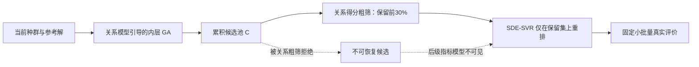
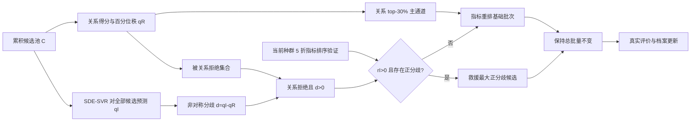

# AdaMaO Top-Q1 完整故事与实验设计报告

## 从“关系粗筛的不可恢复假阴性”到“指标模型的条件式选择性救援”

> 版本：研究设计冻结稿 v1.1（加入批次替换净增益、actual-indicator 抽样与同池/端到端因果边界）  
> 目标期刊层级：Swarm and Evolutionary Computation / Information Sciences 等一区期刊  
> 研究对象：`REMO_new2_AdaMaO_SDEOnly_UniformMix_Original` 及其后续最终版本  
> 核心原则：不虚构尚未完成的实验；所有结论按“已证实—待验证—停止条件”分层。

---

## 1. 执行结论

当前算法可以继续使用 REMO 的关系学习、参考解选择和环境选择作为主干，不需要为了增加代码差异而随意修改这些模块。论文的创新重心应从“用了关系网络和指标模型”转移到以下问题：

> 在关系模型到指标模型的级联预选择中，指标模型只能访问关系粗筛保留的候选。只要真正有价值的候选被关系模型提前剔除，后级指标模型无论多准确都无法纠正这一错误。本文将这种结构性信息损失定义为级联粗筛后悔，并通过候选级反事实审计进行量化；随后，设计一个由指标可靠性和非对称秩分歧共同触发的固定预算例外通道，对“关系模型拒绝、指标模型高度认可”的候选实施选择性救援。

推荐的最终方法暂命名为：

- 中文：**级联感知的条件式选择性救援方法**；
- 英文：**Cascade-Aware Conditional Selective Rescue**；
- 缩写：**CA-CSR**；
- 若需要算法名：**CA-CSR-AdaMaO**。

最终决策如下。

| 模块 | 决策 | 原因 |
|---|---|---|
| REMO 三分类关系网络 | 保留并明确引用 | 它是基础代理，不是本文贡献；稳定且已有性能基础 |
| Hybrid PBI 标签、参考解和 `RefSelect` | 冻结 | 改动会引入新的混杂，不能帮助回答核心科学问题 |
| SDE-SVR 指标模型 | 保留 | 它提供与关系模型异质的候选排序，是补救信号来源 |
| `UniformMix, p=0.5` | 降为稳健基线或外围实现细节 | 现有数据只支持稳健性，不能支持其为核心创新 |
| 现有 softmax/PBI confidence 门控 | 退出主线 | 严格确认结果为 `NO_DISCRIMINATIVE_EVIDENCE`，不能预测候选效用 |
| 关系训练 weighted/curriculum | 不作为核心贡献 | 固定模式已有结果未证明稳定增益，且不解决后级不可见性 |
| 候选级反事实审计 | 必须新增 | 这是证明“关系粗筛确实误杀有用候选”的唯一直接证据 |
| 非对称秩分歧救援 | 必须新增 | 它直接修复已诊断的不可恢复假阴性，而不是泛化地增加探索 |
| 随机、多样性匹配、打乱、反向、oracle 负对照 | 必须新增 | 用于排除“多放一个随机/更分散候选也会变好”等替代解释 |
| 第二主干迁移实验 | Top-Q1 强烈建议 | 证明机制不是当前 REMO 代码的特例 |

---

## 2. 当前证据边界

### 2.1 已被代码或实验直接证实

1. 当前指标模式先按关系得分保留候选池前 30%，之后 SDE-SVR 只重排这一子集。
2. 候选生成内循环也持续用关系得分保留父代，因此关系模型同时影响“生成什么”和“最终看什么”。
3. `all_candidates` 保存了初始候选及各轮内层 GA 候选，因此可以在不改变候选生成的情况下诊断最终粗筛的假阴性。
4. 当前 `UniformMix` 每代以 `p=0.5` 在 explore/indicator 间随机路由，不是 R²AEA 那种按 FE 划分的前后两个时间阶段。
5. 最新 SDE-confidence 确认实验未通过主要门槛：`PrimaryGatePassed=0`，AUROC 置信区间下界约为 0.495，且候选边际 IGD+、短期存活和最终非支配关联接近零。
6. 现有候选策略比较支持 UniformMix 是稳健默认值，但 Holm 校正后仅相对 AlwaysExplore 显著；它没有显著优于 AlwaysIndicator 或 LinearSchedule。

### 2.2 当前仍未被证实，不能提前写成论文结论

1. 关系 top-30% 粗筛是否真的丢失 oracle-useful 候选；
2. 被丢失候选是否集中在“关系低排名、指标高排名”的区域；
3. 秩分歧是否比随机抽样、打乱指标和单纯决策空间多样性更能识别有用候选；
4. 指标模型的交叉验证排序能力是否能预测救援是否成功；
5. 在固定真实评价次数下，救援是否改善最终 IGD+/HV 或至少降低严重尾部失效；
6. 该机制是否能迁移到原始 REMO 或另一关系型 SAEA。

### 2.3 性能前提如何处理

本报告接受“当前最终算法总体性能已经具备一区竞争力”作为用户给定前提，但性能强不等于机制成立。后续优先投入候选级诊断和因果消融，而不是立即重复完整 SOTA 大实验。只有 Stage 0 和 Stage 1 通过后，才值得冻结最终算法并进行正式 30 次对比。

---

## 3. 相关文献的故事结构及对本文的启示

### 3.1 REMO：改变代理学习对象

REMO 的核心问题不是神经网络结构，而是：昂贵多目标优化是否真的需要预测每个目标值。其答案是只学习候选间的相对关系。故事链为：

1. 目标回归在有限样本下困难；
2. 进化选择只需要相对优劣；
3. 用自适应 PBI 产生近似平衡的好/差类别；
4. 构造 `+1/0/-1` 三类关系对；
5. 通过候选与好类、差类样本的双向比较和投票完成预选择。

REMO 的贡献是代理建模范式和完整使用链，而不是单个复杂组件。

来源：[REMO, IEEE TEVC 2022](https://doi.org/10.1109/TEVC.2022.3152582)。

### 3.2 PC-SAEA：关系模型也可能不可靠

PC-SAEA 进一步指出：成对模型虽比绝对回归容易，但不能无条件使用。其模型管理逻辑为：

- 验证集正向准确时正常使用；
- 反向准确时反向使用；
- 两者均不可靠时忽略模型；
- 通过双向预测检查矛盾。

其价值是让“模型可靠性问题—正用/反用/弃用机制—模型管理消融”形成闭环。

来源：[PC-SAEA, SWEVO 2023](https://doi.org/10.1016/j.swevo.2023.101323)。

### 3.3 PIEA：直接学习最终选择需要的指标

PIEA 认为多目标逐目标回归会造成误差累积和建模成本，因此直接预测性能指标，并建立 SDE、加性 epsilon 和 Minkowski 指标池。其历史反馈选择器根据真实评价样本的后验表现更新指标概率，并专门与随机选指标进行比较。

对本文的关键约束是：固定 `p=0.5` 随机混合不能宣称比历史反馈式选择更先进。本文必须把 SDE 定位为补充信息源，而不是把随机选择包装成核心贡献。

来源：[PIEA, Information Sciences 2024](https://doi.org/10.1016/j.ins.2024.121045)。

### 3.4 R²AEA：不同搜索时期解决不同失败

R²AEA 将高维昂贵优化拆成：

- 前期 RWO：利用问题变换和回归模型快速收敛；
- 后期 RMO：利用关系模型和预测熵维持多样性。

其关系标签、关系对构造、三层 FNN 和四向比较与 REMO 高度同源；主要变化是阶段组织、熵感知投票以及参考/环境选择。`tr=0` 和 `tr=1` 是两个单阶段极端，中间阈值实验用于证明组合的必要性。

来源：[R²AEA, SWEVO 2025](https://doi.org/10.1016/j.swevo.2025.101978)。

### 3.5 近期工作对新颖性的限制

近年来已经出现大量分类—回归协作、双代理、指标代理和状态切换算法：

- [CR-SAEA](https://doi.org/10.1016/j.neucom.2024.127629)：分类与回归的双层架构；
- [HES-EA](https://doi.org/10.1109/TEVC.2024.3440354)：聚类代理与双指标代理的层次集成；
- [SIDSAEA](https://doi.org/10.1016/j.swevo.2025.102019)：双集成代理和状态驱动填充准则；
- [MP-SAMaOEA](https://doi.org/10.1016/j.swevo.2025.102275)：目标空间和决策空间多视角填充。

因此，不能把以下内容作为主要 novelty：

- 首次组合关系模型与回归模型；
- 首次使用两个阶段；
- 首次根据状态切换代理；
- 首次使用模型分歧或不确定性。

可争取的新颖性是更窄、更可证伪的命题：

> 异构代理级联中的前级覆盖损失与后级排序误差是两个不同错误源；后级模型被限制在前级保留集时，无法修复前级假阴性。本文针对这一不对称结构设计候选级诊断和例外通道。

---

## 4. REMO、R²AEA 与当前 AdaMaO 的真实关系

### 4.1 R²AEA 的 RMO 与 REMO：实现级对照

| 组件 | 实现关系 | 是否属于 R²AEA 的主要新增 |
|---|---|---|
| `GetOutput_PBI` | 数学逻辑基本相同，自适应控制好类比例 | 否 |
| `GetRelationPairs` | 四类配对和 `0/+1/-1` 标签语义基本相同 | 否 |
| 三层 `patternnet` | 层数和尺度同源 | 否 |
| 四向候选比较 | `C1-x, x-C1, C2-x, x-C2` 同源 | 否 |
| 数据划分 | 本地实现比例不同，R²AEA 为较小训练集 | 小实现差异，不足以构成核心创新 |
| 候选投票 | R²AEA 引入 `+1/±0.5` 性能权重和预测熵 | 是，属于模型使用改造 |
| 阶段组织 | R²AEA 只在后半预算使用 RMO | 是 |
| 参考解/环境选择 | R²AEA 使用 NSGA-III 风格选择，非 REMO 的雷达网格 `RefSelect` | 是框架差异，但不是关系学习创新 |

结论：R²AEA 的关系学习核心确实大量继承 REMO，但通过“前后期失败分解 + RWO/RMO 阶段 + 熵填充 + 阈值消融”形成了独立故事。这说明代码改动量不是决定因素，关键是新机制是否对应新的失败模式并有专门证据。

### 4.2 当前 AdaMaO 不是时间双阶段

当前 UniformMix 版本每代同时训练关系模型和 SDE-SVR，再用固定随机数决定候选模式。它属于随机路由，不是：

```text
前 50% FE 只用关系模型 → 后 50% FE 只用指标模型
```

当前真正存在的是指标模式内部的级联：



这条结构比“随机双阶段”更适合成为论文主线。

---

## 5. 核心科学问题：级联为何会失败

### 5.1 前级覆盖损失和后级排序误差不同

设某代累积候选池为 \(\mathcal C_t\)，关系粗筛保留集合为 \(\mathcal C_t^R\subset\mathcal C_t\)，真实候选效用为 \(u_t(x)\)。这里的效用可以是候选加入当前档案后带来的边际 IGD+ 改善。

对单个评价名额，当前级联的后悔可以分解为：

\[
\underbrace{\max_{x\in\mathcal C_t}u_t(x)-u_t(x_t^{\mathrm{sel}})}_{\text{总选择后悔}}
=
\underbrace{\max_{x\in\mathcal C_t}u_t(x)-\max_{x\in\mathcal C_t^R}u_t(x)}_{\text{粗筛覆盖后悔}}
+
\underbrace{\max_{x\in\mathcal C_t^R}u_t(x)-u_t(x_t^{\mathrm{sel}})}_{\text{保留集内重排后悔}}.
\]

后级指标模型只能降低第二项。只要 oracle-best 候选不在 \(\mathcal C_t^R\) 中，任何仅作用于保留集的指标重排都不可能降低第一项。

### 5.2 覆盖瓶颈命题

**命题 1：**若后级选择器的可选域被限制为 \(\mathcal C_t^R\)，且 \(x_t^*=\arg\max_{x\in\mathcal C_t}u_t(x)\notin\mathcal C_t^R\)，则无论后级预测器在 \(\mathcal C_t^R\) 上多准确，它都无法选择 \(x_t^*\)。

证明由集合包含关系直接得到。该命题不声称关系模型总体无效，而是指出级联架构对局部假阴性的容错为零。

### 5.3 为什么关系粗筛会出现局部假阴性

本研究提出四个待验证原因，而不是提前宣称它们已经成立：

1. **硬类别压缩：**连续的收敛和分布信息最终被硬化为 `Catalog`，类内顺序丢失；
2. **参考覆盖有限：**少量参考解无法均匀表示高维前沿上的所有局部方向；
3. **投票平均化：**候选与大量 C1/C2 样本比较后取均值，局部优势可能被多数无关比较淹没；
4. **双重关系偏置：**关系模型既塑造内层 GA 父代，又执行最终 top-30% 粗筛，使偏差可能累积。

这些原因需要通过分层诊断支持。论文的最低主张只需要证明“有用假阴性存在且后级不可见”，不必一次性证明四个原因全部成立。

---

## 6. 提议机制：级联感知的条件式选择性救援

### 6.1 设计原则

1. 不废弃关系模型，因为它提供稳定、高效的主通道；
2. 不让指标模型接管全部候选，因为其在部分问题上可能不可靠；
3. 只处理关系模型最危险的错误：关系拒绝但指标高度认可的候选；
4. 每代最多使用一个救援名额，不增加真实 FE；
5. 指标模型只有在自身排序能力通过在线验证时才能触发救援；
6. 不使用已被否定的 softmax/PBI confidence 作为候选门控。

### 6.2 双模型秩归一化

对候选池中的每个候选 \(x_i\)，获得：

- 关系得分 \(s_R(x_i)\)，越大越好；
- SDE 指标预测 \(s_I(x_i)\)，越大越好。

分别转成候选池内百分位秩：

\[
q_R(x_i)=1-\frac{\operatorname{rank}_{R}(x_i)-1}{|\mathcal C_t|-1},
\qquad
q_I(x_i)=1-\frac{\operatorname{rank}_{I}(x_i)-1}{|\mathcal C_t|-1}.
\]

这样消除两个代理的数值尺度差异。定义非对称秩分歧：

\[
d(x_i)=q_I(x_i)-q_R(x_i).
\]

只有 \(d(x_i)>0\) 才表示指标模型相对关系模型更认可该候选。本文不把双向分歧都当作不确定性，而只关注可能造成不可恢复假阴性的方向。

### 6.3 关系主通道

保持现有粗筛比例 \(\rho_R=0.30\)：

\[
\mathcal C_t^R=\operatorname{Top}_{\rho_R|\mathcal C_t|}(q_R).
\]

在 \(\mathcal C_t^R\) 中仍由 SDE 指标排序，形成基础候选批 \(S_t^{\mathrm{base}}\)。这一设计保证新方法不是彻底替换已有高性能路径。

### 6.4 指标排序可靠性检查

当前种群已有真实目标值，可计算真实 SDE fitness。对当前种群进行 K 折交叉验证，得到 SDE-SVR 的 out-of-fold 预测，并计算 Kendall 排序相关：

\[
r_t^I=\tau\left(\widehat{f}^{\mathrm{OOF}}_{\mathrm{SDE}},f_{\mathrm{SDE}}\right).
\]

初始无自由阈值版本采用：

\[
G_t^I=\mathbb I(r_t^I>0).
\]

即模型只有在交叉验证排序优于反向/无信息时才可能介入。正式采用前必须在 Stage 0 中验证 \(r_t^I\) 是否能预测真正的救援收益；如果 AUROC 或单调性不成立，不得把它写成可靠性门控。

为降低计算量，开发阶段可使用 5 折；若训练开销明显上升，可改为固定的分层 holdout，但正式论文需报告训练时间。

### 6.5 救援集合与固定预算选择

定义被关系粗筛拒绝的候选：

\[
\overline{\mathcal C_t^R}=\mathcal C_t\setminus\mathcal C_t^R.
\]

候选例外集合为：

\[
\mathcal E_t=\{x\in\overline{\mathcal C_t^R}:d(x)>0\}.
\]

若 \(G_t^I=1\) 且 \(\mathcal E_t\neq\varnothing\)，救援一个候选：

\[
x_t^{\mathrm{rescue}}=\arg\max_{x\in\mathcal E_t}d(x).
\]

若存在并列，依次按 \(q_I\) 降序、\(q_R\) 升序和候选稳定索引裁决。主版本不使用决策空间距离作为 tie-break，避免把“额外多样性”偷偷混入关系—指标互补性的因果解释；决策空间多样性只作为独立敏感性分析。

设当前基线本应评价 \(b_t\) 个候选，固定移除基础批次中指标排名最低的候选 \(z_t\)，则最终仍只评价 \(b_t\) 个：

\[
z_t=\arg\min_{x\in S_t^{\mathrm{base}}}q_I(x),\qquad
S_t=\left(S_t^{\mathrm{base}}\setminus\{z_t\}\right)
\cup\{x_t^{\mathrm{rescue}}\}.
\]

若门控关闭或没有正分歧候选，则完全返回原基线批次。这样新机制每代最多替换一个名额，不增加 FE，也避免引入新的 rescue-ratio 超参数。

这里必须区分“候选自身有用”和“替换后真正有益”。定义批次替换净增益：

\[
\Delta_t(x)=IGD^+\!\left(A_t\cup S_t^{\mathrm{base}}\right)-
IGD^+\!\left(A_t\cup
\left[(S_t^{\mathrm{base}}\setminus\{z_t\})\cup\{x\}\right]\right).
\]

只有 \(\Delta_t(x)>0\) 才表示救援在固定预算下优于当前级联批次。候选边际效用 \(u_t(x)>0\) 只是“该候选并非无用”的证据，不能单独作为 H3/H4 的救援成功真值。

### 6.6 方法流程图



### 6.7 伪代码

```text
Input: candidate pool C, relation model R, indicator model I,
       baseline evaluation batch size b, relation keep ratio rho=0.30

1. sR <- RelationScore(R, C)
2. sI <- IndicatorPredict(I, C)
3. qR <- PercentileRankDescending(sR)
4. qI <- PercentileRankDescending(sI)
5. CR <- top rho candidates according to qR
6. Sbase <- top b candidates in CR according to qI
7. rI <- cross-validated Kendall rank reliability of I on evaluated population
8. E <- {x in C \ CR : qI(x) - qR(x) > 0}
9. if rI > 0 and E is nonempty then
10.     xrescue <- argmax_{x in E} [qI(x) - qR(x)]
11.     S <- top (b-1) candidates of Sbase union {xrescue}
12. else
13.     S <- Sbase
14. end if
15. return S
```

### 6.8 与普通 ensemble disagreement 的区别

普通委员会分歧通常把“模型不一致”当作通用不确定性，倾向评价所有高分歧点。本文的机制更窄：

1. 分歧是异构任务代理之间的秩分歧，不是同构 ensemble 方差；
2. 只关注关系拒绝、指标认可这一不对称方向；
3. 目标不是主动学习整个模型，而是恢复被前级级联屏蔽的候选；
4. 分歧必须通过候选真实边际效用的反事实审计验证；
5. 救援配额固定为一个，并保持真实 FE 不变。

---

## 7. Stage 0：候选级反事实诊断

这是整篇论文最重要、也最容易被跳过的实验。若 Stage 0 不通过，不应继续包装该故事。

### 7.1 为什么现有 confidence probe 不够

现有探针在 `AdaMaOSelection` 返回 `Next` 后才记录候选，因此只观察真正被选中和评价的候选。它看不到：

- 关系 top-30% 之外的候选；
- 指标模型从未获得机会评分的候选；
- 粗筛造成的反事实损失。

所以现有探针只能分析已选候选的 confidence，不能回答“被拒绝候选中是否有更好的解”。

### 7.2 Shadow-oracle 协议

对合成基准，在优化器外部对候选池进行只读真实目标计算：

1. 冻结正常算法的随机流、候选池和最终 `Next`；
2. 复制该代 `all_candidates`、关系得分、指标预测和粗筛状态；
3. 使用基准函数的目标计算接口得到 shadow objectives；
4. shadow 结果不得加入 Archive、Population 或训练数据；
5. 不得修改正常 `Problem.FE`；
6. 正式性能曲线仍只使用算法真实消费的 FE；
7. shadow evaluation 数量单独报告为 diagnostic cost。

这是一项机制诊断实验，不是可部署算法的一部分，也不能用于真实昂贵应用。

主分析只纳入 candidate_mode=indicator、SDE 模型存在且本代粗筛后重排确实成功执行的代。explore 代可作为单独对照层，不能与真实级联代混合后声称“当前 relation→indicator 级联失败”。抽样也不能简单每隔固定代数执行，而应按扣除初始化 FE 后的早、中、晚进度预注册检查点，并在每个检查点捕获随后第一个有效 indicator 代，以免随机模式序列造成选择性缺失。

参考前沿在每个 run 开始时一次性生成并冻结；候选效用使用同一参考集。开发阶段若使用稀疏参考集，必须在预注册的首/末审计代上与完整 Problem.optimum 复算，报告候选效用秩相关、oracle-top-K 重合率和结论翻转率。若灵敏度不足，正式 Stage 0 必须改用完整参考集。

若全量评估所有候选池代价过高，可减少被审计的代数，但被选中的代内应优先全量评价候选；不要先按关系/指标象限抽候选后再计算 Recall@K，因为这会改变分母并产生验证偏差。

### 7.3 候选真实效用

合成问题主指标使用候选对当前档案的边际 IGD+ 改善：

\[
u_t(x)=IGD^+(A_t)-IGD^+(ND(A_t\cup\{x\})).
\]

对于最小化问题，IGD+ 距离使用 \(\max(f(x)-r,0)\)，因此上式方向正确：\(u_t(x)>0\) 表示加入候选后 IGD+ 降低。当前档案中的被支配点不会改变该最小距离，但实现时仍可先取可行非支配集以降低计算量。

候选级 \(u_t(x)\) 用来回答 H1/H2；H3/H4 的主要真值必须改用上一节定义的固定替换净增益 \(\Delta_t(x)\)。此外，为匹配每代实际评价的是一个批次而不是单个点，增加 greedy-oracle 批次效用：

\[
U_t^{\mathrm{all}}(K)=IGD^+(A_t)-
IGD^+\!\left(A_t\cup GreedyTopK(\mathcal C_t,u_t)\right),
\]

\[
U_t^{R}(K)=IGD^+(A_t)-
IGD^+\!\left(A_t\cup GreedyTopK(\mathcal C_t^R,u_t)\right).
\]

这里的 greedy 选择每一步都按加入当前集合后的真实 IGD+ 边际下降选点，避免简单 individual top-K 被同一区域的冗余候选占满。

辅助真值：

- 候选是否进入更新后的非支配档案；
- 候选是否被下一代环境选择保留；
- H1/H3 延迟存活；
- 低目标数问题上的边际 HV；
- 相对于当前档案的 epsilon 改善。

不要继续用“关系对 holdout error”代替候选真实效用，因为它衡量的是分类任务，不是优化决策收益。

### 7.4 核心诊断指标

设 oracle-top-K 为候选池中按真实效用排名前 K 的候选，K 取该代真实评价批量大小。

1. **粗筛 Recall@K**

\[
Recall_R@K=\frac{|TopK_u(\mathcal C_t)\cap\mathcal C_t^R|}{K}.
\]

2. **有用假阴性率**

\[
FNR_u=\frac{|\{x\notin\mathcal C_t^R:u_t(x)>0\}|}
{|\{x\in\mathcal C_t:u_t(x)>0\}|}.
\]

3. **单点与批次覆盖后悔**

\[
Regret_{cover}=\max_{x\in\mathcal C_t}u_t(x)-
\max_{x\in\mathcal C_t^R}u_t(x).
\]

跨问题汇总使用无尺度批次后悔：

\[
Regret_{batch}^{norm}=1-\frac{U_t^R(K)}
{\max(U_t^{all}(K),\epsilon)}.
\]

4. **固定替换净增益与可恢复份额**

对所有关系拒绝候选计算 \(\Delta_t(x)\)。最大正分歧候选的可恢复份额定义为：

\[
Capture_t=
\frac{\max(\Delta_t(x_t^{rescue}),0)}
{\max\left(\max_{x\notin\mathcal C_t^R}\Delta_t(x),\epsilon\right)}.
\]

若拒绝集中不存在正 oracle 替换增益，则该代记为“无可救援机会”，同时记录错误介入率，不能只从分析中删除。

5. **救援机会率**

关系拒绝且指标位于全池 top-K 的候选中，\(\Delta_t(x)>0\) 的比例。

6. **分歧富集倍数**

\[
ER=\frac{P(\Delta_t(x)>0\mid x\notin\mathcal C_t^R, d(x)\text{ high})}
{P(\Delta_t(x)>0\mid x\notin\mathcal C_t^R)}.
\]

7. **门控预测能力**

用每代交叉验证 Kendall 可靠性 \(r_t^I\) 预测 \(\Delta_t(x_t^{rescue})>0\)，报告 AUROC、分箱单调性、预注册阈值 \(r_t^I>0\) 下的错误介入率，以及 gated/ungated 的平均净替换增益。仅证明候选 \(u_t(x)>0\) 不能证明门控能避免有害替换。

### 7.5 预注册假设链

| 假设 | 问题 | 必要证据 |
|---|---|---|
| H1 覆盖缺口 | 关系粗筛是否丢失 oracle-useful 候选 | actual-indicator 代的 Recall@K 小于 1，归一化 greedy-batch 覆盖后悔非零 |
| H2 分歧可识别 | 高正分歧是否富集有用假阴性 | 真实分歧的 replacement gain/capture 优于 random、shuffled、diversity-matched 控制 |
| H3 救援有效 | 固定一个救援名额是否产生净批次收益 | \(\Delta_t(x_{rescue})\)、一步环境选择结果及正式配对运行优于控制 |
| H4 门控有效 | CV 排序能力能否区分何时应该救援 | Kendall OOF 可靠性能判别 \(\Delta_t>0\)，且预注册门控降低负替换而不损害净收益 |
| H5 优化有效 | 同 FE 下能否改善最终结果 | 正式 IGD+/HV 不劣且尾部风险下降 |

### 7.6 强制停止条件

以下任一情况出现时，不得继续把 CA-CSR 写成已成立贡献：

1. actual-indicator 代的 Recall@K 长期接近 1，且归一化批次覆盖后悔可以忽略；
2. 高正分歧候选的替换净增益不优于随机、shuffled 或多样性匹配控制；
3. shuffled-indicator 与真实指标分歧表现相同；
4. 指标可靠性对 \(\Delta_t>0\) 的 AUROC 置信区间不能排除 0.5，或 \(r_t^I>0\) 不能降低负替换风险；
5. 同 FE 正式优化中救援稳定损害结果；
6. 所有效果只来自多样性，而非关系—指标互补性。

若 H1 失败，说明当前级联并没有故事所称的结构性问题；若 H1 通过但 H2 失败，可改为“安全随机旁路”工程方案，但不能宣称指标条件补救；若 H2/H3 通过而 H4 失败，应删除在线门控，使用固定单名额救援并缩小 claim。

---

## 8. 负对照与因果消融

### 8.1 必须保持的共同条件

Stage 0 的同池反事实诊断必须共享：

- 相同初始化和 run ID；
- 相同候选生成随机流；
- 相同关系训练数据与网络；
- 相同 SDE-SVR 训练数据；
- 相同 RefSelect、Archive 和环境选择；
- 相同每代真实评价批量；
- 相同总 FE；
- 只改变最终候选分配机制。

这一级证据在同一个冻结候选池上计算 CurrentCascade、Random、Shuffled、Reverse、IndicatorAll 和 Oracle 的一步反事实，因此可把差异定位到最终候选分配规则。

但端到端优化实验不能要求各版本在第一次介入后仍拥有完全相同的候选池：救援改变已评价解，随后 Archive、训练集、父代和候选池的分化正是算法处理效应的中介，而不是应被消除的“污染”。端到端 A0—A6 只需保持相同初始化、run ID、命名随机流、预算、共同模块和唯一代码因素；采用配对统计，并把候选池分化解释为机制的下游效应。论文应明确区分：

1. 同池 shadow policy evaluation：识别一步直接效应；
2. 一步真实介入：验证固定替换是否兑现 shadow 方向；
3. 端到端配对运行：估计包含轨迹分化在内的总算法效应。

### 8.2 诊断负对照

| 编号 | 版本 | 回答的问题 |
|---|---|---|
| D0 | Oracle all-candidate audit | 当前粗筛的理论损失和可恢复上限是多少 |
| D1 | Relation-only ranking | 不使用指标时的覆盖和排序能力 |
| D2 | Indicator-only ranking | 为什么不直接让指标接管全部候选 |
| D3 | Current relation→indicator cascade | 当前真实结构的基线 |
| D4 | Oracle rescue | 若准确救援一个假阴性，理论收益有多大 |

### 8.3 算法负对照与消融

| 编号 | 版本 | 机制 |
|---|---|---|
| A0 | CurrentCascade | 当前关系 top-30% → SDE 重排 |
| A1 | IndicatorAll | SDE 对全池排序，无关系粗筛 |
| A2 | RandomRescue | 从关系拒绝集随机替换一个名额 |
| A2b | DiversityMatchedRandom | 从与真实救援候选具有相同决策新颖度分位的拒绝候选中随机替换 |
| A3 | ShuffledDisagreement | 打乱 SDE 排名后按“分歧”救援 |
| A4 | ReverseDisagreement | 在同一关系拒绝集合中选择最负分歧方向，用作 falsification |
| A5 | UngatedRescue | 始终救援最大正分歧候选 |
| A6 | CA-CSR Full | 指标可靠性通过时救援最大正分歧候选 |
| A7 | OracleRescue | 仅诊断，不作为可部署算法或正式公平基线 |

最关键的因果比较：

1. A6 vs A0：完整方法是否有用；
2. A6 vs A2：是否不仅仅是增加随机探索；
3. A6 vs A2b：效果是否只是决策空间多样性；
4. A6 vs A3：真实指标排序是否包含信息；
5. A6 vs A5：条件门控是否降低负 replacement gain；
6. A6 vs A1：关系主通道是否仍然必要；
7. A4 应明显较差或无效，否则分歧方向解释有问题。

### 8.4 与现有 confidence 的负结果如何使用

不要隐藏 confidence 失败。它可成为一个有价值的负对照：

> 分类 softmax 或 PBI 一致性可以与关系标签错误相关，却未必与候选的边际优化收益相关。模型中心的“预测是否自信”不等于决策中心的“被拒绝候选是否值得救援”。

这也解释了为什么本文不用 R²AEA 式预测熵直接控制救援，而要求指标排序可靠性和跨代理非对称分歧同时成立。

---

## 9. 分阶段实验路线

### Stage 0A：粗筛失效诊断

目标：只回答 H1，不改优化算法。

建议问题：

- DTLZ2：规则、相对容易；
- DTLZ4：偏置；
- DTLZ7：断裂前沿；
- WFG4：多峰；
- WFG6：非可分；
- WFG8：参数依赖。

建议设置：

- \(M\in\{10,20\}\)；
- 决策维数沿用正式协议，WFG 使用其合法维数并在表中记录实际 D；
- 每个实例 10 个配对 run 作为方向筛查；
- 按 post-initialization 进度预注册早/中/晚检查点，在每个检查点捕获随后第一个 SDE 实际参与的 indicator 代；
- 被审计代内全量 shadow candidate audit，explore 代只作分层对照；
- 不输出算法优劣结论，只输出 Recall@K、归一化 greedy-batch 覆盖后悔和 false-negative 分布。

方向筛查通过标准：DTLZ 与 WFG 两个家族中各至少一个问题的 run-level bootstrap 同时支持平均 Recall@K 低于 0.95、归一化批次覆盖后悔大于 0。未满足有效 indicator 代和 run 数要求时只能输出 INSUFFICIENT_DATA。

### Stage 0B：分歧信号验证

目标：回答 H2 和 H4。

分析：

- 按正分歧五分位统计正 replacement gain 率与归一化 capture；
- 与随机、diversity-matched random、shuffled 和反向分歧比较；
- 评估 Kendall \(r_t^I\) 对 \(\Delta_t>0\) 的 AUROC、校准和预注册 \(r_t^I>0\) 门控的净收益；
- 分问题、分早中晚阶段报告，避免 pooled 结果掩盖方向反转。

H2 的唯一主要比较固定为“真实分歧减 shuffled 的归一化 replacement capture”；diversity-matched random 为关键排他性对照。两个问题家族的方向必须一致，不能在 utility、precision、survival 中事后挑选显著者。H4 只有在 AUROC 的 run-cluster bootstrap 下界高于 0.5，且 \(r_t^I>0\) 相对 ungated 降低负替换率而不降低平均净替换增益时通过；否则删除门控，不强行保留。

### Stage 1：小规模机制筛查

目标：在相同 FE 下回答 H3/H5 的方向性。

版本只跑：A0、A2、A3、A5、A6。  
问题优先：Stage 0 中覆盖后悔高的 3 个问题，加 2 个覆盖后悔低的负问题。  
每个实例：10 个严格配对 run。

进入正式实验的门槛：

- A6 相对 A0 在高后悔问题上有一致改善；
- A6 不依赖单个问题；
- A6 优于 A2/A3；
- 在低后悔问题上没有明显安全性损失；
- 训练时间增加可接受。

### Stage 2：正式因果消融

在冻结代码后运行 A0—A6 的必要子集，每实例 30 次。推荐主表：A0、A1、A2、A3、A5、A6；A4 和 A7 放诊断或补充材料。

### Stage 3：正式 SOTA 对比

建议至少包含：

- REMO；
- CSEA；
- PC-SAEA；
- PIEA；
- R²AEA；
- HES-EA 或另一近期指标代理算法；
- 一种 2025—2026 的双代理/多视角方法；
- CA-CSR-AdaMaO。

问题集：

- DTLZ1—DTLZ7；
- WFG1—WFG9；
- 至少一组 MaF/LSMOP 或不规则前沿问题；
- 2—3 个真实工程问题或公开昂贵应用。

目标数建议覆盖 \(M=5,10,20\)，如果论文定位为 super-many-objective，可将 20/30 目标作为重点。决策维数必须与标题定位一致；若声称 high-dimensional decision space，应加入 D=100/200 的实例，否则标题只写 many-objective。

### Stage 4：可迁移性

Top-Q1 强化实验二选一：

1. 将 CA-CSR 插入原始 REMO，证明它对 relation-first SAEA 具有普适性；
2. 保持当前主干，替换第二指标（如 epsilon 或 Minkowski）重复 Stage 0B，证明机制不依赖 SDE 的偶然尺度。

优先推荐方案 1，因为它更直接回答“是否只是 AdaMaO 特例”。

---

## 10. 统计与复现实验规范

### 10.1 配对设计

- 各消融使用相同初始化种子和 run ID；
- 候选模式随机流单独固定并记录；
- 若某版本改变随机调用次数，应使用独立命名的 `RandStream`，避免后续随机轨迹漂移；
- 诊断分析应保存候选池 ID、生成代数、post-initialization 进度、实际 candidate mode、指标是否真正参与、关系秩、指标秩、粗筛状态、候选边际效用、批次替换净增益、参考点数量和 shadow 成本；
- 同池诊断要求候选池完全一致；端到端算法比较只要求共同随机数设计和唯一代码因素，不把介入后的轨迹分化误判为实验失控。

### 10.2 指标

正式性能：

- IGD+ 为主；
- HV 为辅，高目标数需说明精确或 Monte Carlo 计算；
- 最终非支配集规模、运行时间和模型训练时间；
- 最坏 10% run 或 upper-tail regret，用于证明尾部安全性。

机制指标：

- Recall@K；
- useful-FNR；
- normalized greedy-batch coverage regret；
- disagreement enrichment；
- replacement gain/capture 与 negative-replacement rate；
- gate AUROC；
- H1/H3 survival；
- archive entry rate。

### 10.3 检验

- 单问题配对 run：Wilcoxon signed-rank，并报告效应量和置信区间；
- 跨问题总体：Friedman/Aligned Friedman；
- 事后比较：Holm 或 Shaffer 校正；
- 对多个机制指标同样控制多重比较；
- 除均值/中位数外报告分布和问题级方向；
- 不把 pooled 百万候选对或同一 run 的多代当作独立样本；主要统计单元是 run，代级数据只用于 run 内聚合或以 run 为 cluster 的分层 bootstrap；
- 跨问题不得直接平均原始边际 IGD+，使用 batch regret、replacement capture 或相对 baseline IGD+ 的无尺度量；
- 稀疏参考前沿必须做相对完整参考前沿的秩与 top-K 灵敏度验证。

### 10.4 禁止的统计做法

- 用候选对数量巨大来制造极小 p 值；
- 只报告 pooled AUROC，不报告问题级方向；
- 只比较完整方法和最弱基线；
- 把 development 10-run 筛查写成正式统计证明；
- 在看到结果后不断修改门控阈值再用同一批数据声称显著。

---

## 11. 论文图表规划

### 主文建议图

1. **Fig. 1：级联覆盖瓶颈示意图**  
   展示关系粗筛误杀后，指标模型不可见；右侧展示 CA-CSR 例外通道。

2. **Fig. 2：候选级反事实诊断**  
   横轴关系百分位，纵轴指标百分位，颜色为真实边际 IGD+；突出左上或“关系低—指标高”区域。

3. **Fig. 3：分歧五分位与真实有用率**  
   同时画真实、shuffled、random 三条曲线及置信区间。

4. **Fig. 4：覆盖后悔随搜索阶段变化**  
   分早/中/晚期、分问题族；验证是否真有阶段差异，但不预设结论。

5. **Fig. 5：门控可靠性与救援收益**  
   若 H4 通过再放主文；不通过则作为负结果放补充材料。

6. **Fig. 6：最终 IGD+ 收敛曲线和尾部箱线图**。

### 主文建议表

1. 文献定位与区别表；
2. Stage 0 覆盖诊断表；
3. 负对照与因果消融表；
4. DTLZ/WFG/MaF 正式 IGD+ 主表；
5. HV/运行时间表；
6. 真实问题表；
7. 跨问题平均秩和 Holm 结果。

---

## 12. 论文故事线

### 第一幕：异构代理互补并不自动成立

关系模型适合在有限数据下学习相对优劣；指标模型直接逼近多目标选择所需的整体性能。已有工作通常并行组合、阶段切换或在关系筛选后使用回归/指标模型，但默认后级模型能够补充前级模型。

### 第二幕：级联结构存在不可恢复信息损失

当前代码和一般关系→指标级联都限制后级模型只观察前级保留集。由覆盖瓶颈命题可知，前级误杀候选后，后级精度无法修复。传统分类准确率、softmax confidence 或预测熵只描述模型任务，不直接测量下游选择后悔。

### 第三幕：候选级反事实诊断暴露问题

通过 shadow-oracle 审计，分别测量粗筛 Recall@K、coverage regret 和有用假阴性。进一步检查这些假阴性是否集中在关系—指标非对称秩分歧区域，并用随机、打乱和反向分歧进行证伪。

### 第四幕：有条件地开放例外通道

保留关系主通道；SDE 对全池做廉价排序；只有指标模型的交叉验证排名为正，且存在“关系拒绝—指标认可”候选时，才用一个固定名额救援最大正分歧候选。真实评价预算不增加。

### 第五幕：从候选恢复到最终优化

候选级分析证明“找得到”，固定 FE 消融证明“救得回”，正式 SOTA 对比证明“最终值得”。在低覆盖后悔问题上测试安全性，在高覆盖后悔问题上测试收益，避免只挑有利问题。

---

## 13. 推荐题目、摘要骨架与贡献表述

### 13.1 推荐英文题目

首选：

> **Mitigating Irrecoverable Screening Errors in Heterogeneous Surrogate-Assisted Many-Objective Optimization**

备选：

> **When Relation Screening Misses: Conditional Indicator Rescue for Expensive Many-Objective Optimization**

> **Cascade-Aware Selective Rescue in Relation- and Indicator-Assisted Evolutionary Optimization**

标题中是否加入 `High-Dimensional`，必须由最终 D=100/200 实验决定，不能仅因为目标数多就写 high-dimensional。

### 13.2 摘要骨架（实验结果占位，禁止提前填数字）

> Relation learning has become an effective alternative to objective-wise regression in expensive many-objective optimization. Existing heterogeneous surrogate frameworks often place an indicator or regression surrogate after relation-based screening, implicitly assuming that the downstream model can compensate for errors made by the upstream relation model. We show that this assumption does not hold in a cascaded preselection architecture: once a useful candidate is rejected by the relation screen, a downstream model restricted to the retained subset cannot recover it. We formulate this structural loss as coarse-screening regret and develop a counterfactual candidate audit to distinguish coverage loss from within-subset ranking error. Based on the audit, we propose a cascade-aware conditional selective rescue mechanism. It retains the stable relation-guided main channel, while allowing a validated indicator surrogate to rescue at most one relation-rejected candidate exhibiting the largest asymmetric rank disagreement, without increasing the number of expensive evaluations. Random, shuffled, reversed-disagreement and oracle controls are introduced to isolate the source of improvement. Experiments on [test suites and real-world problems] demonstrate that [fill only after formal experiments].

### 13.3 贡献点写法

1. **诊断贡献：**揭示并形式化关系—指标级联中“前级覆盖损失不可由后级排序修复”的结构性问题，并提出候选级反事实审计协议；
2. **机制贡献：**提出基于指标排序可靠性和非对称跨代理秩分歧的固定预算例外通道，只救援关系拒绝但指标高度认可的候选；
3. **证据贡献：**通过随机、shuffled、反向分歧、indicator-all 和 oracle 控制，将候选覆盖恢复、代理互补性与普通探索效应区分开；
4. **优化贡献：**在相同真实 FE 下验证候选级恢复是否转化为最终 IGD+/HV 和尾部鲁棒性，并通过第二主干或第二指标验证可迁移性。

不要写：

- 首次组合关系网络和指标模型；
- 首次采用双阶段；
- 首次使用模型分歧；
- 新的环境选择；
- 新的参考解选择；
- confidence 已被证明可靠。

---

## 14. 预期审稿质疑与回答

### Q1：这不就是多评价一个随机候选吗？

回答依赖 A6 vs A2。保持相同配额和总 FE，若真实分歧救援显著优于随机救援，才能说明收益来自跨代理信息而非额外探索。

### Q2：模型分歧作为不确定性早已有了，创新在哪里？

本文不主张首次使用分歧。创新点是：诊断异构级联的不可恢复覆盖损失，使用有方向的“关系拒绝—指标认可”分歧恢复前级假阴性，并以候选真实边际效用验证，而不是把任意分歧当作通用 uncertainty。

### Q3：为什么不直接让指标模型对全部候选排序？

用 A1 回答。指标模型在有限样本和复杂问题上可能全局失真；CA-CSR 保留关系主通道，只在可靠且存在明确例外时开放一个名额。

### Q4：为什么继续使用 REMO 的环境选择和关系网络？

本文研究对象是异构代理的候选管理，而不是重新设计基础 MOEA。冻结成熟主干是严格单因素识别的需要。第二主干迁移用于证明机制不依赖单一实现。

### Q5：shadow evaluation 是否破坏昂贵优化的公平性？

shadow evaluation 只用于离线机制诊断，不反馈算法、不计入任何正式性能结果。所有最终算法比较使用相同真实 FE；报告会单独披露诊断成本。

### Q6：`r_I>0` 是否仍是拍脑袋阈值？

它对应优于无信息/反向排序的自然边界，而非调参得到的性能阈值。更重要的是，门控是否有效要在独立 Stage 0B 中验证；若无判别力就删除门控，不在正式结果上反复调阈值。

### Q7：效果是否仅来自决策空间多样性？

通过随机救援、shuffled disagreement、diversity-matched random 和反向分歧控制回答。主版本用模型秩和稳定候选索引处理并列，不把决策空间多样性作为 tie-break；多样性版本只作为独立敏感性分析。

### Q8：关系模型已经参与候选生成，最终救援仍无法恢复从未生成的候选。

承认并限定 claim：本文修复的是累积候选池内的 post-generation screening blind spot，不声称解决关系引导生成的全局偏差。候选池包含第一轮未经过关系筛选的 offspring 及各轮中间候选，因此仍存在可审计的被拒绝集合。生成级盲区可作为后续工作。

---

## 15. 安全实施方案

### 15.1 不修改冻结基线

现有测试冻结了 UniformMix、ModeBase、HybridPBI、GetOutput、`AdaMaOSelection` 和 `RefSelect` 的 Git blob。新工作不应直接编辑这些文件。

推荐新增：

```text
REMO_new2_AdaMaO_SDEOnly_CA_CSR.m
REMO_new2_AdaMaO_SDEOnly_CA_CSR_Base.m
private/AdaMaOSelectionCACSR.m
private/ScoreAdaMaOCandidates.m
private/ValidateSDEIndicatorRanking.m
private/SelectAsymmetricDisagreementRescue.m
REMO_new2_AdaMaO_SDEOnly_CascadeAudit.m
ComputeCascadeMarginalIGDp.m
ComputeCascadeBatchCounterfactual.m
AnalyzeCascadeAudit.m
tests/test_REMO_new2_AdaMaO_CA_CSR.m
```

基线保持字节级不变。开发版本通过复制和明确注释继承逻辑，后续若要重构共享函数，必须先建立基线行为回放测试。

### 15.2 第一版只实现一个新因素

第一实现版本固定：

- 关系 keep ratio 仍为 0.30；
- 基础候选批量不变；
- 每代最多一个救援名额；
- 只用 SDE；
- 不改 relation training；
- 不改 Hybrid PBI；
- 不改环境选择；
- 不引入 adaptive rescue quota；
- 不使用现有 confidence。

只有第一版通过 Stage 0/1，才考虑自适应配额或生成级旁路。否则复杂化只会稀释因果证据。

### 15.3 测试要求

1. frozen baseline hash 仍通过；
2. gate 关闭时，新选择器与 current cascade 返回完全相同候选；
3. rescue 开启时总候选数不变；
4. rescue 必须来自关系拒绝集合；
5. rescue 必须是最大正分歧候选；
6. 固定替换槽必须是基础批次中指标排名最低者，且 replacement gain 的合成算例精确通过；
7. 指标模型不可用、非有限预测或 CV Kendall 非正时严格回退；
8. 候选去重和剩余 FE 边界正确；
9. audit 不改变正常 FE、Archive 和随机流；
10. paired streams 在基线和新方法间一致；
11. 主分析只消费实际使用指标的 indicator 代，explore 代不得误入；
12. 稀疏与完整参考前沿灵敏度、WFG 合法 D 和小样本边界通过测试。

---

## 16. 工作优先级和预计产出

### P0：一周内完成的最小可证伪工作

1. 新增只读 candidate trace；
2. 在 6 个代表问题上完成 shadow audit；
3. 输出 Recall@K、coverage regret 和关系/指标秩二维图；
4. 验证正分歧是否优于 random/shuffled；
5. 给出继续/停止结论。

这一阶段比直接跑完整算法消融更重要。若分歧不富集有用候选，应尽早停止，避免数周算力浪费。

### P1：机制原型

1. 实现固定一个名额的 UngatedRescue；
2. 实现 CV indicator gate；
3. A0/A2/A3/A5/A6 小规模配对筛查；
4. 冻结最终公式。

### P2：正式消融和 SOTA

1. 30 次正式消融；
2. DTLZ/WFG/MaF/真实问题；
3. 更新到近期 SOTA；
4. 运行时间和模型开销；
5. 第二主干迁移。

### P3：论文写作

按“结构命题—反事实诊断—选择性机制—负对照—最终优化”顺序写作，不按代码模块流水账写作。

---

## 17. Top-Q1 达标检查表

### 必须满足

- [ ] 直接证明当前关系粗筛存在非平凡 useful false negatives；
- [ ] 指标正分歧对这些假阴性有稳定富集；
- [ ] 真实分歧优于随机和 shuffled 控制；
- [ ] 相同 FE 下救援候选级收益能转化为最终性能；
- [ ] 明确区分覆盖损失与保留集内排序误差；
- [ ] confidence 负结果被如实处理；
- [ ] 关系网络、参考解和环境选择被明确标注为 inherited；
- [ ] 至少 30 次正式运行、跨问题校正和效应量；
- [ ] 近期 SOTA、复杂问题族和真实问题；
- [ ] 代码、随机流、审计数据和分析脚本可复现。

### SWEVO 强竞争稿建议满足

- [ ] 第二主干或第二指标迁移；
- [ ] 候选级二维诊断图形成强视觉证据；
- [ ] 尾部风险分析解释 WFG4/6/7/8 类严重失败；
- [ ] 在线门控在独立诊断数据上通过，而非在正式结果上调参；
- [ ] 真实问题中采用无 PF 的延迟效用指标。

### 若冲击 TEVC/更高要求

- [ ] 给出更一般的 batch coverage-regret 分解或理论界；
- [ ] 在两个不同关系型 SAEA 中验证；
- [ ] 更广的 100/200 维决策空间实验；
- [ ] 至少两个可信真实应用；
- [ ] 开源候选级审计框架，体现方法学贡献。

---

## 18. 最终判断

### 是否需要大改 REMO 主干？

不需要。环境选择、参考解选择和关系网络可以继续沿用。为了“看起来改得多”而更换这些模块，会破坏当前性能并增加无法解释的混杂。

### 当前改动是否足以直接写 Top-Q1？

仅凭现有 `UniformMix + SDE indicator` 不足。它可以作为性能良好的工程算法，但故事仍停留在“两个代理组合”。缺少的不是更多模块，而是直接证明级联缺陷、用最小机制修复、用负对照排除替代解释的证据。

### 最值得新增的唯一核心改动是什么？

在不增加真实 FE 的前提下，为关系粗筛建立一个由“指标排序可靠性 + 关系拒绝/指标认可的非对称秩分歧”触发的单名额例外通道。

### 这条故事为什么比 R²AEA 式双阶段更适合当前算法？

因为它来自当前代码中真实存在的 post-generation cascade，而不是事后把每代随机路由解释成时间阶段；它能用候选级反事实数据直接证伪，也能用随机、shuffled、indicator-all 和 oracle 控制形成清晰因果链。

最终论文应达到如下证据闭环：

```text
结构命题：后级不可修复前级覆盖损失
        ↓
候选级诊断：关系粗筛确实误杀有用候选
        ↓
信号验证：正向跨代理秩分歧富集这些假阴性
        ↓
机制：可靠时只救援一个最大正分歧候选
        ↓
负对照：优于随机、shuffled、反向和 indicator-all
        ↓
最终优化：相同 FE 下改善 IGD+/HV 和尾部鲁棒性
        ↓
迁移：第二主干或第二指标仍成立
```

这才是一条接近 SWEVO Top-Q1 标准、并且经得住审稿人逐层追问的完整故事。

---

## 19. 关键本地证据索引

- 当前级联选择：`private/AdaMaOSelection.m:55-93, 188-249`；
- UniformMix 固定随机路由：`ResolveSDECandidateMode.m:22-57`；
- 主循环与 SDE 模型：`REMO_new2_AdaMaO_SDEOnly_UniformMix_RelationModeBase.m:42-119`；
- 最新 confidence 决策：`C:\Users\lsx\Desktop\AdaMao实验表\置信度confidence\SDE版本\confirmation_sde\ConfidenceSDE_decision.csv`；
- 候选策略分析：`C:\Users\lsx\Desktop\AdaMao实验表\消融实验\候选解模块\20目标IGD+综合分析_SWEVO性能判断与Baseline建议.md`；
- REMO 原文：`D:\我的文档\研究生\已看文献\relation_model\Expensive_Multiobjective_Optimization_by_Relation_Learning_and_Prediction.pdf`；
- PC-SAEA 原文：`D:\我的文档\研究生\已看文献\relation_model\A pairwisecomparisonbasedsurrogate-assistedevolutionary algorithm.pdf`；
- PIEA 原文：`D:\我的文档\研究生\已看文献\PIEA.pdf`；
- R²AEA 原文：`D:\我的文档\研究生\已看文献\relation_model\R2AEA高维昂贵多目标优化.pdf`。
