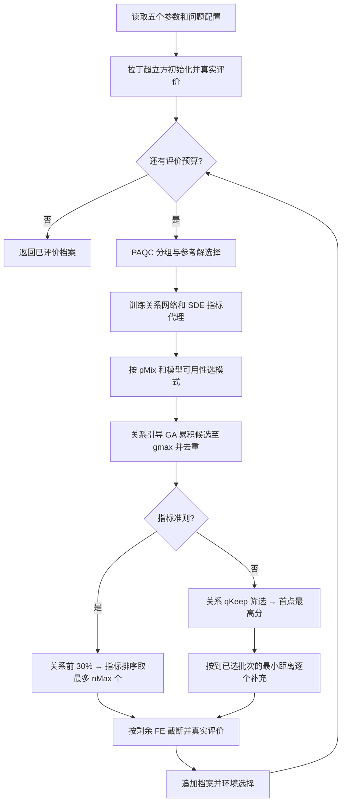

# Pruned：删除五项参数后的算法与完整流程

## 1. 版本身份与实现范围

- 入口：`REMO_new2_AdaMaO_SDEOnly_UniformMix_Pruned.m`。
- 建立日期：2026-09-11。
- 基础：本次执行时磁盘上的 `REMO_new2_AdaMaO_SDEOnly_UniformMix_Original`；不是从 Maximin 版本继续改，也不是恢复某个旧提交。
- 原版和 Maximin 版保持不变。源文件身份记录在 `source_manifest.json`。
- 本版是用户指定五项同时删减的组合版本，不是单因素消融。性能变化不能归因于其中某一个删除项。
- 已验证接口、候选选择和预算行为；没有执行正式多问题 IGD/HV 性能实验，不能称为性能已经保持或提升。

## 2. 五项删除及替代规则

| 删除项 | 实际修改 | 行为变化 |
|---|---|---|
| 指标分支 0.70 分位阈值 | 关系粗筛后直接按预测指标降序取批次 | 候选充足时避免重复筛选；小候选池的批次数可能变化 |
| nMin=4 | 删除参数、补足逻辑和 4 个候选的回退数量 | 只保留 nMax 上限，筛选后不足时全部取出，不再补足到 4 |
| lambda0=0.35、0.45 误差门控 | 删除探索模糊度奖励、奖励中的进度衰减和留出误差推断 | 探索质量得分直接使用关系模型得分 R |
| 指标粗筛最少 20 个 | 粗筛大小改为 ceil(0.30*C) | 小候选池可以只留下 1、2、3 等少量候选 |
| 批次得分—距离权重 0.75/0.25 | 先取最高关系得分点，再用批内最大最小距离逐个选点 | 质量通过前置筛选和首点选择体现；后续由距离决定，并列时使用关系得分 |

保留探索 `qKeep=0.80` 质量筛选。距离对象是当前已选批次，不是完整历史档案。距离沿用原版原始决策变量的欧氏距离；实现使用平方距离，排序等价，没有新增边界归一化或变量权重。

删除的是上述特定用途的常数，不是把全项目所有相同数字删除。例如关系训练划分的 0.75、参考解二值分类目标比例中的 0.70、Shape_Estimate 中的 20 都属于其他保留机制。

## 3. 保留的对外超参数

入口按以下顺序接收五个算法参数。原版七参数调用不可直接复用；超过五个参数时报错。

| 顺序 | 参数 | 默认值 | 约束 | 作用 |
|---|---|---:|---|---|
| 1 | gmax | 3000 | 正整数 | 每轮代理辅助 GA 累计生成候选数的停止阈值；不是 GA 代数，也不是真实 FE |
| 2 | pMix | 0.50 | [0,1] | 指标模型可用时，本轮采用指标准则的概率 |
| 3 | rGood | 0.25 | (0,0.5] | 当前种群进入正组的比例，数量为 ceil(n*rGood) |
| 4 | qKeep | 0.80 | [0,1] | 探索关系得分的分位点；默认保留最高约 20%，并列时可能更多 |
| 5 | nMax | 6 | 正整数 | 每轮真实评价批次上限；还受筛选后候选数和剩余 FE 限制 |

`nMax` 是上限，不保证每轮正好评价六个。删除最小批次数后，小候选池可能带来更多模型更新轮次。

平台配置 `Problem.N`、`M`、实际 `D`、`maxFE` 和 `run` 不属于这五个算法参数。`Problem.N` 是环境选择的目标种群规模，不能和初始化样本数混为一谈。

## 4. 保留的内部参数、固定规则与实现常数

这些值仍影响行为，不能因为没有对外暴露就称为“无参数”。表内按作用区分，数值容差与优化策略参数不是同一类。

| 所属步骤 | 保留设置 | 作用 |
|---|---|---|
| 初始化 | D<=10 时 N_init=11D-1，否则 N_init=100；按剩余预算截断 | 真实初始样本数；拉丁超立方采样 |
| PAQC 参考解 | k=min(Problem.N,max(6,ceil(1.5M)))，并由 RefSelect 限制至可用解数 | 参考解分类与候选交配池 |
| PAQC 参考方向 | Nref=N_init；M<=3 或当前种群 n<50 时用均匀方向 | 参考方向请求规模与构造分支 |
| 自适应方向回退 | 非支配解数 < max(10,Nref/2) 或 <2，或任一目标范围 <1e-12 | 回退到均匀参考方向；否则使用每个非支配解的单位径向向量 |
| 连续 PBI | theta=5 | 沿方向投影距离与垂直距离的组合 |
| PAQC 融合 | t=FE/maxFE，H=(1-t)S+tL | 此进度融合保留，和已删除的探索奖励衰减不同 |
| 参考解二值分类 | delt 在 [-20,20] 内二分；目标 true 比例 [0.3,0.7]；区间宽度 <0.1 停止；归一化阈值 1 | 沿用现有二值标签构造；delt 可以为负，不等同连续 PBI 的 theta |
| 关系对抽样 | 去除自配对；同组对数量约为一类跨组对数量 | 平衡三类关系标签 |
| 外层数据划分 | 每类约 75% 关系对训练，向上取整，其余留出 | 保留原数据划分和随机抽样；本版不再用留出集计算误差，也没有改成全量训练 |
| 关系网络 | 输入 2D，隐藏层 [3D,2D,D]，三类输出 | patternnet；训练输入沿用 mapminmax |
| 网络训练（本机 R2023a 默认） | trainscg；dividerand=70%/15%/15%；epochs=1000；max_fail=6；min_grad=1e-6；goal=0；time=Inf | 这次没有改训练默认值；内部划分作用于上述约 75% 数据 |
| 网络优化（本机 R2023a 默认） | sigma=5e-5，lambda=5e-7 | trainscg 内部参数；不是已经删除的探索 lambda0；运行版本的其他默认值仍由工具箱管理 |
| 模式随机流 | mt19937ar；seed=mod(10000000+run,intmax('uint32')) | 模式抽样独立于全局随机流；run 不会自动固定初始化及网络训练随机数 |
| 遗传算子 | OperatorGA 参数 {1,15,1,5} | 交叉概率 1、交叉分布指数 15、突变参数 1（实数算子逐变量概率 1/D）、突变分布指数 5 |
| 探索关系汇总 | 使用每个解对预测的最大类别概率加权平均 | 保留原候选生成行为；不是模糊度奖励，不含新增系数 |
| 指标关系汇总 | 算术平均 | 保留原指标准则关系打分 |
| 指标粗筛 | ceil(0.30*C) | 仅保留前 30%，没有最少 20 个 |
| SDE 形状估计 | 非支配解 <20 时 Lp=1；否则 17 个候选 Lp；箱线图因子 1.5 | 沿用 Shape_Estimate，属于指标机制，与本次删除的粗筛下限 20 无关 |
| Lp 候选集 | [0.27,0.36,0.43,0.5,0.57,0.66,0.75,0.86,1,1.15,1.35,1.6,2,2.4,3.1,4.2,6.5] | 选择归一化范数标准差最小的候选值 |
| SDE 细化 | 归一化尺度 3；近零阈值 1e-4；tansig 输出 | Lp 理想点距离细化近零 SDE 分数 |
| 指标代理 | RBF-SVR；KernelScale='auto'；Standardize=true | 其余 fitrsvm 设置沿用当前 MATLAB 默认值，不另行调参 |
| 环境选择 | 非支配排序＋径向网格；网格分辨率 ceil(sqrt(k_sel))；排序式含 0.1*M | 环境选择时 k_sel 为不超过可用解数的 Problem.N；PAQC 内选择参考解时为参考解请求数量 |
| 数值处理 | eps；目标最小值及分类余弦中 1e-6；方向回退 1e-12 | 沿用源实现的数值处理，不属于本次删除对象 |

## 5. 完整执行流程

### 步骤一：初始化真实档案

按 D 计算 N_init，并截断至剩余真实评价预算。生成 N_init 个拉丁超立方点，映射到变量上下界，调用 Problem.Evaluation，得到初始种群 P 和历史档案 A=P。初始化模式专用随机流，Lp 上次值设为 1。

例如 D=30、预算 B=300 时，初始化使用 100 FE，剩余 200 FE；这是配置示例，不是对已有 Excel 的预算身份认定。

### 步骤二：PAQC 分组和参考解

每轮先检查终止条件并计算 t=FE/B。根据当前种群构造均匀或自适应方向 V，从当前种群按 k 选择已评价参考解 Ref。

连续评分为：

\[
S_i=\frac{1}{1+d_{1i}+5d_{2i}}.
\]

方向关联沿用原实现：按原始目标向量的余弦相似度关联；投影和垂距按相对理想点的目标向量计算。参考解分类产生二值标签 L_i，其归一化阈值为 1，类别平衡系数按上表二分搜索。

融合：

\[
H_i=(1-t)S_i+tL_i.
\]

取 H 最大的 ceil(|P|*rGood) 个解作为正组 C1，其余全部作为非正组 C2。Ref 还将参加后续交配池。函数仍返回原有 confidence 等兼容输出，主程序不使用它们。

### 步骤三：训练关系模型

按 C1/C2 构造有序解对 [x_i,x_j]：正组对非正组为 +1，反向为 -1，同组为 0。去掉自配对并平衡样本。沿用约 75%/25% 的关系对分层划分；网络只收到训练部分，再按其原有内部 70%/15%/15% 划分训练。

训练三隐藏层网络 [3D,2D,D]，输出顺序 [+1,0,-1]。本版不计算留出误差，不计算或奖励候选模糊度。

关系得分 R(x) 的原有公式保留。将候选与 C1、C2 构成 [C1,x]、[x,C1]、[C2,x]、[x,C2] 四组预测，汇总概率分别记为 a,b,c,d，则：

\[
R(x)=2\{c(-1)+d(+1)-a(+1)-b(-1)\}.
\]

探索模式的四组概率仍采用最大类别概率加权平均；指标模式使用算术平均。R 越大，关系模型认为候选越优。

### 步骤四：训练指标模型并选择本轮模式

对当前种群估计 Lp，计算 SDE 适应度，并训练从决策向量到 SDE 分数的 RBF-SVR。指标分数越大，排序优先级越高。估计或拟合失败时按原有回退规则处理，无法得到指标模型则使用探索。

每轮从专用流抽取 u；若指标模型可用且 u<pMix，则采用指标准则，否则采用探索准则。默认 pMix=0.5 是每轮选择概率，不保证整个运行恰好一半 FE 分给各分支。

### 步骤五：关系模型引导的候选生成

用当前种群决策向量与 Ref 作为初始交配池，运行 OperatorGA({1,15,1,5})。候选按本轮模式下的 R(x) 排序，保留最多 |Ref| 个作为下一轮父代，再和 Ref 组合产生下一批。

累计保留所有生成的候选，包括没有成为下一轮父代的候选，直到累计生成量达到或超过 gmax。阈值检查在批次之间进行，所以累计量可能略超 gmax。最终按决策向量精确逐行去重，得到 C。此过程不调用真实目标函数。

### 步骤六 A：探索分支——质量筛选后构造分散批次

1. 计算所有候选的关系得分 R。
2. 取阈值 tau=quantile(R,qKeep)，保留 Cq={x in C:R(x)>=tau}。默认保留最高约 20%，并列分数可能使数量更多。
3. 设本轮目标数量 b=min(nMax,|Cq|,floor(B-FE))。没有 nMin，也不从质量门槛外补足。
4. 首个解取 R 最大的候选，得到已选集合 S。
5. 逐个加入：

\[
x^*=\arg\max_{x\in C_q\setminus S}\min_{s\in S}\|x-s\|_2^2.
\]

每加入一个解即更新距离，直到选满 b。距离严格相等时优先关系得分高者，仍并列则按候选原始行顺序。

该分支保留“先保证候选质量，再扩展批内分布”的结构；不再将质量得分与距离线性加权。它也不同于已有 Maximin 版的“远离整个历史档案”。没有新增距离归一化；不同变量范围可能影响原始欧氏距离的贡献，这是沿用原版度量的限制。

### 步骤六 B：指标分支——关系粗筛后直接指标排序

1. 按关系得分降序，保留 C 的前 ceil(0.30*|C|) 个，得到 Cr。
2. 由 RBF-SVR 预测 Cr 的 SDE 分数；预测异常则回退到该集合的关系得分。
3. 直接按该分数降序取 min(nMax,|Cr|,floor(B-FE)) 个。

没有“最少 20 个”，没有第二次 0.70 分位筛选，也没有不足 4 个时补足。若 C 只有 10 个，Cr 只有 3 个，本轮最多评价 3 个。

### 步骤七：真实评价与档案更新

若候选为空且预算尚有剩余，沿用遗传补充思路，用 {1,15,1,5} 产生候选、逐行去重，再按 nMax 和剩余 FE 截断。仍无候选时警告并停止。

调用 Problem.Evaluation(Next)，更新真实 FE，将结果追加到完整档案 A。候选池内部去重保留；沿用原版，不额外做相对完整历史档案的重复点过滤。

### 步骤八：环境选择与循环

从完整档案通过 RefSelect(A,Problem.N) 执行非支配排序和径向网格选择，得到下一轮种群 P。返回步骤二，直到达到真实评价预算或平台其他终止条件。

种群是模型训练与候选生成的当前工作集合，档案保存累计已评价解；算法通过 NotTerminated(Archive) 保存累计档案作为结果。没有训练解对时本版警告并结束，避免原代码无 FE 进展的循环。初始化也增加了预算截断；这两项是边界防护，不是优化准则变更。

## 6. 总体流程图



图中省略异常回退，完整条件见步骤三、四、七。

## 7. 运行方式与可复现性

在 PlatEMO 根目录运行：

```matlab
addpath(genpath(pwd));
problem = DTLZ2('N',100,'M',10,'D',30,'maxFE',300);
algorithm = REMO_new2_AdaMaO_SDEOnly_UniformMix_Pruned( ...
    'parameter',{3000,0.50,0.25,0.80,6}, ...
    'run',1,'save',-10,'outputFcn',@(a,p) []);
rng(1,'twister');
algorithm.Solve(problem);
result = algorithm.result{end,2};
```

这是正式参数形状的示例，不代表已执行该性能实验。示例结果留在内存中，不自动写正式结果文件。必须记录实际问题 D、N、maxFE、全局 rng 种子、run、MATLAB 版本和源文件身份。run 控制模式流，但全局随机种子需要单独指定。

本地 `platemo.m` 入口会执行 `rng('shuffle')`，因此“先 rng(seed)，再 platemo(...)”不能固定全局随机数。需要共同种子对照时采用上述直接构造对象、在 Solve 前设置 rng 的方式。正常非配对运行仍可在 GUI 中选择新算法，或用五参数形式调用 platemo。

## 8. 验证结果

2026-09-11，本机 MATLAB R2023a 验证：

- 全部 17 个 .m 文件（含测试）静态分析均为 0 条消息。
- 10 项候选选择测试通过：质量筛选、逐点距离更新、并列规则、原始距离单位、小候选池、指标重排序和预算限制。
- 4 项集成测试通过：探索/指标配置下 54→60→61 FE、初始化预算截断、拒绝旧七参数调用。
- 集成运行使用 DTLZ2、M=3、D=5、gmax=150、短预算，仅用于验证执行行为；不构成正式优化性能证据。
- 原始共享模块逐文件校验；除入口和候选选择模块外，原版的共享模块保持字节一致。
- 详细记录：`tests/validation.log`。未启动正式多问题、多种子对照。

## 9. 相对原版的研究解释边界

这是五项组合简化。即使它性能恢复，也不能说明所有被删项都无用；即使退化，也不能说明每一项都必需。小候选池批次数改变会影响训练频率，删除权重会改变批内候选身份，二者都是本版应如实报告的机制变化。
