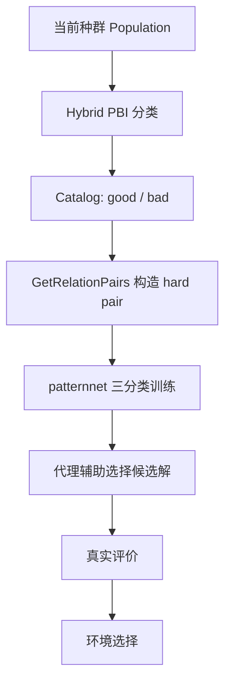
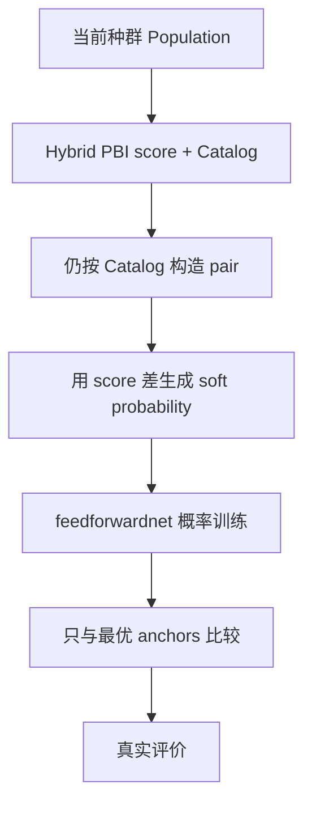
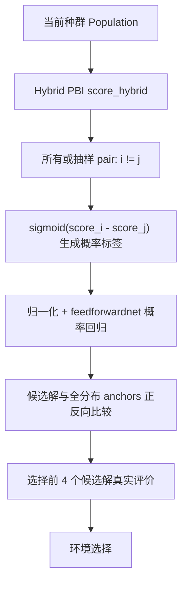

# REMO_new2_TrueSR 算法改进汇报

## 1. 汇报目的

本次改动的目标是：在已有 `REMO_new2` 表现优于 `R2_REMO` 的基础上，引入真正的软排序学习机制，使代理模型不再只学习“好/坏”二分类关系，而是学习两个解之间更细粒度的优劣概率。

当前新增算法位于：

- `Algorithms/Multi-objective optimization/REMO_new2_TrueSR/REMO_new2_TrueSR.m`
- `Algorithms/Multi-objective optimization/REMO_new2_TrueSR/GetSoftRelationPairsFromScore.m`
- `Algorithms/Multi-objective optimization/REMO_new2_TrueSR/RSurrogateAssistedSelection_TrueSR.m`

核心思想可以概括为：

```matlab
P(x_i better than x_j) = sigmoid(alpha * (score_i - score_j))
```

其中 `score_i` 来自 `REMO_new2` 中已有的 hybrid PBI 评价分数，`P` 是用于训练代理模型的连续概率标签。

---

## 2. 原始 REMO 与 REMO_new2 的基本思路

REMO 的核心思想不是直接预测昂贵目标函数值，而是训练一个关系模型，判断两个解之间的相对优劣关系。这样做的优点是：

1. 多目标优化中目标函数间存在冲突，直接回归多个目标函数容易累积误差。
2. 在昂贵优化场景下，真实评价样本很少，学习“相对关系”通常比学习绝对目标值更容易。
3. 代理模型只需要辅助筛选候选解，不一定要精确预测目标值。

`REMO_new2` 在 REMO 基础上引入了 hybrid PBI 分类：

```matlab
score_hybrid = alpha * score_v + (1-alpha) * double(label_dyn)
```

其中：

- `score_v` 由参考向量场和 PBI 距离得到，偏向全局分布和收敛性；
- `label_dyn` 由动态参考解和 PBI 分类得到，偏向当前种群附近的局部优劣判断；
- `alpha = 1 - ratio`，使得早期更偏全局，后期更偏局部。

因此，`REMO_new2` 的优势主要来自 hybrid PBI score 能兼顾收敛性、多样性和动态搜索阶段。

---

## 3. 旧版 REMO_new2_SR 的主要问题

之前的 `REMO_new2_SR` 虽然尝试引入 soft relation，但仍然保留了 hard `Catalog` 的样本构造方式，因此存在几个问题。

### 3.1 中间解被错误混入坏类

旧逻辑中：

```matlab
good_num = ceil(N / 4);
bad_num  = good_num;
good_idx = idx_sorted(1:good_num);
bad_idx  = idx_sorted(end-bad_num+1:end);

Catalog = false(N,1);
Catalog(good_idx) = true;
```

看起来是前 25% 为好解、后 25% 为坏解，但实际上只有前 25% 被标为 `true`，其余 75% 全部是 `false`。之后构造关系对时：

```matlab
C1_index = Catalog == 1;
C2_index = Catalog ~= 1;
```

这会导致中间 50% 的解也被当作坏解参与训练。对于硬分类 REMO，这种粗划分还能勉强解释；但对于排序学习，这会损失中间解携带的排序信息。

### 3.2 soft 标签仍然受 hard Catalog 限制

旧版 `GetSoftRelationPairsFromCatalog` 虽然用 `score_hybrid` 差值生成概率：

```matlab
Ps = 1 ./ (1 + exp(-alpha * delta));
```

但配对集合仍然来自 `C1C1`、`C2C2`、`C1C2`、`C2C1`。也就是说，训练样本仍然依赖 hard `Catalog`，soft probability 只是覆盖在旧二分类框架上的一层连续标签，没有真正使用全排序信息。

### 3.3 网络输入缺少归一化

原始 REMO 训练网络前使用了：

```matlab
[TrainIn_nor,TrainIn_struct] = mapminmax(TrainIn');
```

旧版 SR 直接使用原始决策变量训练 `feedforwardnet`。如果变量尺度差异较大，sigmoid 输出容易饱和，概率学习会不稳定。

### 3.4 候选解评分只比较最优 anchors

旧版 `model_select_SR` 只计算候选解相对前 K 个 anchor 的胜率均值：

```matlab
scores(i) = mean(P(x_i better than best anchors));
```

这会使模型更像在判断“候选解是否能超过精英解”，而不是判断候选解在当前种群整体排序中的位置。对于昂贵优化，这种评分可能过强地偏向 exploitation，降低探索性和多样性。

---

## 4. REMO_new2_TrueSR 的具体改动

本次改动没有直接修改 `REMO_new2`，而是新增一个独立实验版本 `REMO_new2_TrueSR`。它保留 `REMO_new2` 已经有效的 hybrid PBI 评价框架，只替换关系学习部分。

### 4.1 保留 REMO_new2 的 hybrid PBI score

在主流程中仍然调用：

```matlab
[~,~,~,~,Ref,scoreHybrid] = HybridPBI_Classification(...
    Population,ratio,'Nref',N,'k',k,'theta',5);
```

但 `scoreHybrid` 不再只用于前 25%/后 25% 分类，而是作为连续排序依据。

这样做的原因是：根据已有实验观察，`REMO_new2` 效果优于 `R2_REMO`，说明当前问题上 hybrid PBI 的选择压力更适合。因此主实验应优先在 `REMO_new2` 框架上增强排序学习，而不是切换到表现较弱的 R2 框架。

### 4.2 用连续 score 构造真正的 soft ranking pair

新增函数 `GetSoftRelationPairsFromScore.m`：

```matlab
[I,J] = find(~eye(N));
delta = Score(I) - Score(J);
Ps    = 1 ./ (1 + exp(-alpha .* delta));
XXs   = [Input(I,:),Input(J,:)];
```

含义如下：

- 对所有 `i ~= j` 的解构造有序 pair；
- 如果 `score_i > score_j`，则 `P(i better than j) > 0.5`；
- 如果两个解分数接近，则标签接近 0.5；
- 分数差越大，概率越接近 1 或 0。

这与旧版本最大的区别是：不再先把解分成 good/bad 两类，而是直接利用完整排序分数。

### 4.3 限制 pair 数量，避免训练代价过高

虽然 `N=100` 时全配对数量约为 `N*(N-1)=9900`，仍然可接受，但为了兼容更大种群和更多实验，代码中保留了 `pairMax` 参数：

```matlab
[k,gmax,pairMax,alphaSoft,anchorNum] = Algorithm.ParameterSet(6,3000,12000,6,20);
```

默认 `pairMax=12000`。如果 pair 总数超过上限，则随机采样。

### 4.4 网络改为概率回归

原始 REMO 使用 `patternnet + onehot` 做三分类，输出 `{1,0,-1}`。TrueSR 改为连续概率学习：

```matlab
net = feedforwardnet([ceil(xDim*1.5),xDim,ceil(xDim/2)]);
net.layers{end}.transferFcn = 'logsig';
net.trainFcn = 'trainscg';
net.performFcn = 'mse';
net.divideFcn = 'dividetrain';
```

输出层使用 `logsig`，使预测值落在 `(0,1)`，直接表示：

```matlab
P(x_i better than x_j)
```

同时恢复输入归一化：

```matlab
[TrainInNor,TrainInStruct] = mapminmax(TrainIn');
```

预测候选解时复用同一归一化结构：

```matlab
testPairsNor = mapminmax('apply',testPairs',Smodel.mp_struct)';
```

### 4.5 候选解选择改为全分布 anchors

旧版 SR 只和最优 K 个解比较。TrueSR 改为从当前种群的排序分布中均匀取 anchors：

```matlab
[~,rankIndex] = sort(score,'descend');
anchorRank    = unique(round(linspace(1,numel(rankIndex),anchorNum)));
anchors       = modelX(rankIndex(anchorRank),:);
```

这样 anchors 覆盖：

- 高分解；
- 中间解；
- 低分解。

候选解评分时，同时计算正向和反向 pair：

```matlab
forwardPairs = [nextBlock,anchorBlock];
reversePairs = [anchorBlock,nextBlock];
```

最终分数为：

```matlab
pairScore = 0.5 .* (probForward + 1 - probReverse);
scores    = mean(pairScore,2);
```

这样可以缓解神经网络预测不对称的问题。例如，理想情况下：

```matlab
P(x_i better than a) + P(a better than x_i) = 1
```

如果模型不满足这个互补关系，反向 pair 可以起到一致性校正作用。

---

## 5. 算法流程对比

### 5.1 REMO_new2



### 5.2 REMO_new2_SR



问题在于：虽然标签变 soft，但 pair 的来源仍然是 hard Catalog。

### 5.3 REMO_new2_TrueSR



---

## 6. 预期效果

### 6.1 更充分利用排序信息

旧方法只关心解是否属于 good/bad。TrueSR 使用连续 `score_hybrid` 差值，能够表达：

- 很明显的优劣关系；
- 接近解之间的不确定关系；
- 中间解的相对位置信息。

因此，训练数据的信息密度更高，理论上能提高代理模型对候选解排序的稳定性。

### 6.2 减少 hard label 边界噪声

在 hard classification 中，排序第 25 名和第 26 名可能被强行分到不同类别，但二者真实质量可能非常接近。TrueSR 中如果二者 `score_hybrid` 接近，则：

```matlab
P(i better than j) ≈ 0.5
```

这能降低边界样本对模型的误导。

### 6.3 改善候选解筛选的鲁棒性

通过全分布 anchors，候选解不再只和精英解比较，而是被放到当前种群整体排序背景中评估。这有利于区分：

- 明显优于低分解但不一定超过最优解的潜力解；
- 只在局部看起来好但全局排序不稳定的解；
- 与已有精英过近、探索价值有限的解。

### 6.4 更符合昂贵优化的代理使用目标

昂贵多目标优化中，代理模型不一定需要精确预测目标值，而是需要把有限真实评价预算分配给更有潜力的候选解。TrueSR 的输出是候选解在关系比较中的平均胜率，更直接服务于“筛选”而不是“拟合目标函数”。

---

## 7. 可能风险与需要验证的问题

### 7.1 soft 标签依赖 score_hybrid 的质量

TrueSR 并没有改变 `score_hybrid` 本身。如果某些问题上 hybrid PBI score 与真实 Pareto 质量不一致，soft 排序会继承这种偏差。

因此实验中需要对比：

- `REMO`
- `REMO_new2`
- `REMO_new2_SR`
- `REMO_new2_TrueSR`
- 可选：`R2_REMO`

### 7.2 alphaSoft 影响标签软硬程度

`alphaSoft` 越大，标签越接近 hard label；越小，标签越接近 0.5。默认设置为：

```matlab
alphaSoft = 6
```

建议做小规模敏感性实验：

```matlab
alphaSoft = 3, 6, 10
```

如果 `alphaSoft` 太大，TrueSR 会退化为近似硬排序；如果太小，训练信号可能过弱。

### 7.3 pair 数量和训练时间增加

pairwise ranking 的样本数是 `O(N^2)`。当前默认 `pairMax=12000`，对于 `N=100` 基本覆盖全配对。但如果后续种群规模更大，应通过 `pairMax` 控制训练代价。

### 7.4 MSE 不是 RankNet 原始交叉熵损失

当前 MATLAB 实现中使用：

```matlab
net.performFcn = 'mse';
```

这是为了尽量贴合现有 REMO 神经网络训练框架。RankNet 原论文使用的是 pairwise cross entropy。后续如果想进一步改进，可以考虑自定义交叉熵损失，但实现复杂度会提高。

---

## 8. 与已有文献的关系

### 8.1 REMO：关系学习方向是合理的

Hao 等人在 IEEE Transactions on Evolutionary Computation 发表的 REMO 工作题为 *Expensive Multiobjective Optimization by Relation Learning and Prediction*，发表于 2022 年，卷 26 第 5 期，页码 1157-1170，DOI 为 `10.1109/TEVC.2022.3152582`。该工作说明了在昂贵多目标优化中，用关系学习和预测代替直接目标回归是一条已有且有效的路线。

对应到本工作：TrueSR 没有否定 REMO 的关系学习框架，而是把原来的离散关系标签进一步推广为连续概率关系。

参考链接：[CiNii 条目](https://cir.nii.ac.jp/crid/1360584346087268608)

### 8.2 PC-SAEA：pairwise comparison surrogate 已被用于昂贵多目标优化

Tian 等人在 *Swarm and Evolutionary Computation* 上发表的 PC-SAEA 工作提出了 pairwise comparison based surrogate model。该文指出，相比回归模型和分类模型，pairwise comparison 模型可以更好平衡正负样本，并用于候选解选择。文中还明确说明该模型输入为两个解的决策向量，输出表示哪个解更优的标签。

对应到本工作：

- 相同点：都使用两个解的拼接向量作为代理模型输入；
- 相同点：都把候选解选择转化为 pairwise comparison；
- 不同点：PC-SAEA 更偏 hard pairwise label，而 TrueSR 使用 `score_hybrid` 差值生成 soft probability label；
- 不同点：TrueSR 是嵌入 REMO_new2 的 hybrid PBI 框架中，而不是完整替换为 PC-SAEA。

参考链接：[ScienceDirect 条目](https://www.sciencedirect.com/science/article/pii/S2210650223000962)

### 8.3 RankNet：soft pairwise probability 的机器学习依据

Burges 等人的 RankNet 论文 *Learning to Rank using Gradient Descent* 提出了用神经网络学习排序函数，并使用 pairwise probability 表示两个样本之间的排序关系。其核心形式是：

```text
P_ij = sigmoid(o_i - o_j)
```

其中 `o_i` 和 `o_j` 是模型对两个样本的输出。该论文还强调，pairwise ranking 可以避免把排序问题强行转化为固定类别或固定 rank 边界。

对应到本工作：

- RankNet 是从模型输出差得到排序概率；
- TrueSR 是从已有 `score_hybrid` 差得到训练目标概率；
- 二者共同点是都把排序关系表示为 pairwise probability，而不是 hard class。

参考链接：[Microsoft Research 页面](https://www.microsoft.com/en-us/research/publication/learning-to-rank-using-gradient-descent/)；[PDF](https://www.microsoft.com/en-us/research/wp-content/uploads/2005/08/icml_ranking.pdf)

### 8.4 CSEA：分类代理是已有路线，但信息粒度较粗

Pan 等人的 CSEA 工作 *A Classification-Based Surrogate-Assisted Evolutionary Algorithm for Expensive Many-Objective Optimization* 是 classification-based SAEA 的代表之一。分类代理的优点是避免直接回归多个目标函数，但缺点是标签通常较粗，容易受到类别边界影响。

对应到本工作：TrueSR 可以看成从 classification-based relation surrogate 向 learning-to-rank surrogate 的过渡。

参考链接：[IEEE Xplore 条目](https://ieeexplore.ieee.org/document/8281523/)

---

## 9. 是否已有文献完全这样改过？

目前查到的文献中，有三个相关方向：

1. **REMO**：用关系学习解决昂贵多目标优化；
2. **PC-SAEA**：用 pairwise comparison surrogate 辅助昂贵多目标优化；
3. **RankNet**：用 sigmoid 概率建模 pairwise ranking。

但是暂未看到与本实现完全一致的组合方式，即：

```text
REMO_new2 hybrid PBI score
    + 全排序 pair 构造
    + sigmoid(score_i - score_j) soft probability label
    + 候选解与全分布 anchors 正反向比较
```

因此可以在汇报中表述为：

> 本方法不是凭空提出，而是把 REMO 的关系学习框架、PC-SAEA 的 pairwise surrogate 思路，以及 RankNet 的 soft pairwise probability 学习方式结合起来，形成适合 REMO_new2 的软排序代理模型。已有文献分别支持这些组成部分，但当前这种在 REMO_new2 hybrid PBI score 上构造 soft ranking label 的做法，更像是一个面向当前算法框架的改进实验。

---

## 10. 推荐实验设计

### 10.1 主对比算法

建议至少比较：

- `REMO`
- `REMO_new2`
- `REMO_new2_SR`
- `REMO_new2_TrueSR`

如果时间允许，补充：

- `R2_REMO`
- `R2_REMO_SR`

### 10.2 消融实验

建议做以下消融：

| 实验版本 | 目的 |
|---|---|
| `REMO_new2` | 验证 hybrid PBI baseline |
| `REMO_new2_SR` | 验证旧 soft relation 是否有效 |
| `REMO_new2_TrueSR` | 验证真软排序是否优于旧 SR |
| `TrueSR` 去掉反向 pair | 验证正反向一致性校正是否必要 |
| `TrueSR` 只用 best anchors | 验证全分布 anchors 是否有效 |

### 10.3 参数敏感性

建议优先测试：

```matlab
alphaSoft = 3, 6, 10
anchorNum = 10, 20, 30
pairMax   = 6000, 12000, 20000
```

其中优先级最高的是 `alphaSoft`。

### 10.4 评价指标

建议使用：

- HV
- IGD
- 运行时间
- 每代代理模型验证 MSE 或排序准确率

排序准确率可定义为：

```text
如果 score_i > score_j 且 net([x_i,x_j]) > 0.5，则该 pair 判断正确。
```

---

## 11. 组会汇报时可以强调的结论

1. `REMO_new2_TrueSR` 的改动不是简单把前后 25% 改成前后 50%，而是取消 hard Catalog 对训练 pair 的限制，直接学习完整排序信息。
2. 该方法保留了 `REMO_new2` 中已经表现较好的 hybrid PBI score，因此不是切换到一个新的弱 baseline，而是在当前较强 baseline 上增强代理模型。
3. soft probability label 能缓解 hard label 的边界噪声，尤其适合昂贵优化中样本少、分类边界不稳定的情况。
4. 全分布 anchors 加正反向 pair 比较，可以让候选解评分更接近整体排序位置，而不是只判断是否超过精英解。
5. 文献上，REMO 支持关系学习，PC-SAEA 支持 pairwise comparison surrogate，RankNet 支持 sigmoid soft ranking probability。本方法是这三类思想在 REMO_new2 框架下的组合和适配。

---

## 12. 当前实现状态

已完成：

- 新增独立算法目录 `REMO_new2_TrueSR`；
- 完成 soft pair 构造函数；
- 完成概率回归神经网络训练；
- 完成全分布 anchors 候选解评分；
- 通过 MATLAB `checkcode` 静态检查；
- 通过小预算 ZDT1 smoke run。

小预算测试命令：

```matlab
[decs,objs,cons] = platemo(...
    'algorithm',{@REMO_new2_TrueSR,2,40,1000,6,8},...
    'problem',@ZDT1,...
    'D',3,...
    'maxFE',40);
```

测试结果：

```text
Smoke run finished: 40 solutions, 2 objectives.
```

---

## 13. 后续工作建议

第一阶段建议先跑小规模 benchmark，确认 TrueSR 是否稳定优于 `REMO_new2_SR`。如果 TrueSR 在多数问题上优于旧 SR，但不一定优于 `REMO_new2`，说明 soft ranking 方向有效但还需要调参或改 model management。

第二阶段再考虑加入：

- RankNet-style cross entropy loss；
- 基于验证集排序准确率的模型可靠性判断；
- 正向使用、反向使用、忽略模型的管理策略；
- 自适应 `alphaSoft`，早期更软、后期更硬。

第三阶段如果需要写论文，可以把贡献点收束为：

> 面向昂贵多目标优化的 hybrid PBI soft relation learning，将 hard good/bad relation learning 推广为基于连续质量分数的 pairwise probability ranking。

