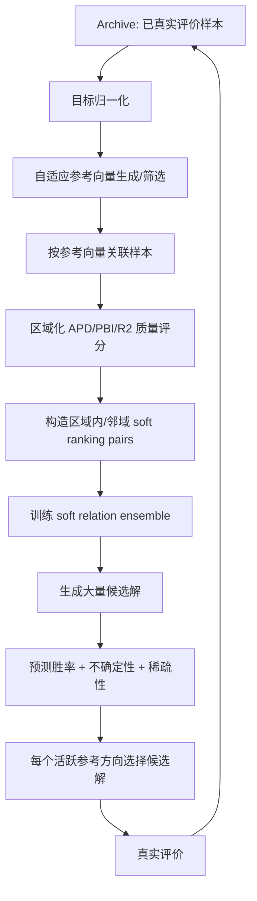

# 面向 5-20 目标昂贵优化的 REMO 改进方向分析与论文方案建议

## 1. 本文档回答的问题

你当前的研究目标是：

> 改进 REMO 原始算法在超多目标问题，尤其是 5-20 个目标之间的性能，并基于该方向形成一篇论文。

已有算法版本包括：

- `REMO`：原始关系学习昂贵多目标优化算法；
- `REMO_new2`：在 REMO 上加入 hybrid PBI 分类/评分；
- `REMO_new2_SR`：旧版 soft relation 尝试；
- `REMO_new2_TrueSR`：目前新增的“真软排序”版本。

本文档主要回答四个问题：

1. `REMO_new2` 和 `REMO_new2_TrueSR` 能否改善 5-20 目标下 REMO 的痛点？
2. 如果不能完全解决，主要缺口在哪里？
3. 文献中有哪些类似思路可以借鉴？
4. 如果目标是发论文，下一步应该如何设计一个更有贡献度的算法？

---

## 2. 简要结论

结论先说清楚：

> `REMO_new2` 和 `REMO_new2_TrueSR` 能缓解 REMO 在超多目标下的一部分问题，但还不足以单独支撑一篇“面向 5-20 目标昂贵优化”的高质量论文。

原因是：

- `REMO_new2` 通过 hybrid PBI score 提高了选择压力，比原始 hard relation 更适合多目标场景；
- `REMO_new2_TrueSR` 通过 soft pairwise ranking 减少了 hard label 噪声，提高了关系模型的信息利用率；
- 但二者仍然没有系统解决 many-objective optimization 的核心难点：参考向量覆盖、Pareto 支配失效、目标空间高维多样性维持、模型不确定性管理和不同 Pareto front 形状适应。

如果以论文为目标，建议不要只把贡献点写成“REMO + soft ranking”。更有潜力的方向是：

> 以 `REMO_new2_TrueSR` 为关系学习内核，进一步加入 many-objective 专用的自适应参考向量、区域化软排序代理模型和不确定性驱动的候选解选择。

可以考虑的论文算法名称：

```text
MaSR-REMO: Many-objective Adaptive Soft Ranking REMO
```

或：

```text
AVSR-REMO: Adaptive Vector-guided Soft Relation Learning for Expensive Many-objective Optimization
```

---

## 3. 5-20 目标下 REMO 原始算法的主要痛点

### 3.1 Pareto 支配关系失去选择压力

当目标数从 2-3 增加到 5、10、20 时，种群中大部分解会互不支配。此时基于 Pareto 层级的选择会变弱，很多解都处在同一非支配层。

文献中也反复指出，many-objective optimization 的核心难点之一就是非支配解数量快速增加，导致 Pareto-based MOEA 的选择压力下降。2025 年的 ranking-prediction based expensive MaOP 工作也明确提到，传统 SAEA 在 expensive many-objective optimization 中会受到 Pareto selection pressure loss 的影响。

这对 REMO 的影响是：

- REMO 原始关系标签来自 PBI/参考解附近的 good/bad 划分；
- 如果高维目标空间中 good/bad 边界不稳定，关系模型学到的标签会噪声很大；
- 一旦训练标签噪声大，代理模型会错误引导昂贵评价预算。

### 3.2 原始 REMO 的参考解数量过少

原始 REMO 默认参数：

```matlab
k = 6
```

即只选 6 个参考解。

对于 2-3 目标，6 个参考解还能覆盖一部分 Pareto front。但对于 5-20 目标，6 个参考解显然不足以覆盖高维 Pareto front 的不同方向。结果是：

- 很多目标区域没有代表性参考解；
- PBI 分类会偏向少数方向；
- 关系模型训练样本不能覆盖整个目标空间；
- 候选解选择容易集中到局部区域。

### 3.3 当前 RefSelect 对高维多样性表达不足

当前 REMO 系列中的 `RefSelect.m` 使用雷达图映射：

```matlab
RLoc(:,1) = sum(P.*cos(theta),2)./sum(P,2);
RLoc(:,2) = sum(P.*sin(theta),2)./sum(P,2);
```

它把 M 维目标压缩到二维雷达坐标，再进行网格多样性选择。

这种方法在低目标时直观，但在 5-20 目标下会出现信息压缩问题：

- 多个高维方向可能映射到相近的二维位置；
- 目标空间中的角度/方向差异被压缩；
- 不能像 RVEA、NSGA-III 那样显式维护高维参考向量上的覆盖。

因此，如果目标是 many-objective，仍使用现有 `RefSelect` 会成为主要短板。

### 3.4 高维目标空间中参考向量和 Pareto front 形状容易不匹配

很多 many-objective 算法依赖参考点或参考向量，例如 NSGA-III、RVEA、K-RVEA。但文献也指出，固定参考向量容易和真实 Pareto front 形状不匹配，特别是：

- convex / concave front；
- disconnected front；
- degenerate front；
- irregular front；
- badly scaled objectives。

如果参考向量分布和 Pareto front 不匹配，算法会浪费评价预算在无效方向上。

当前 `REMO_new2` 的 `HybridPBI_Classification` 虽然有一个 `AdaptiveReferenceVectors`，但它仍比较简化：

- 非支配解数量不足时退回 `UniformPoint`；
- 对高维、稀疏、退化 PF 的适配能力有限；
- 没有显式维护 active/inactive reference vectors；
- 没有像 K-RVEA 那样用不确定性和参考向量位置共同管理模型。

### 3.5 缺少代理模型不确定性管理

昂贵优化中，代理模型不只是要预测“谁更好”，还要判断“哪里不确定、值得真实评价”。Kriging-based SAEA 的一个重要优势是可以提供预测均值和方差。

当前 REMO / REMO_new2 / TrueSR 都主要输出关系预测值或胜率，没有显式不确定性。结果是：

- 代理模型可能过早自信；
- 候选解选择偏 exploitation；
- 容易陷入局部区域；
- 对 5-20 目标这种高维稀疏数据场景不够稳。

---

## 4. REMO_new2 能解决哪些痛点？

`REMO_new2` 的核心改动是 hybrid PBI score：

```matlab
score_hybrid = alpha * score_v + (1-alpha) * double(label_dyn)
```

其中：

- `score_v` 来自参考向量场，偏全局；
- `label_dyn` 来自动态参考解 PBI 分类，偏局部；
- `alpha = 1 - ratio`，早期偏全局，后期偏局部。

### 4.1 能改善的部分

`REMO_new2` 对 many-objective 有一定帮助：

1. 它不完全依赖 Pareto 支配关系，而是引入 PBI/参考向量评价。
2. 它给每个解一个连续的 `score_hybrid`，比单纯 good/bad 更有信息。
3. 早期偏全局、后期偏局部的策略适合昂贵优化中的逐步聚焦。

### 4.2 仍然不足的部分

但 `REMO_new2` 还不够：

1. `Catalog` 最终仍然是 hard good/bad；
2. 默认 `k=6` 对 5-20 目标太少；
3. `RefSelect` 的二维雷达映射不适合作为 many-objective 多样性机制；
4. 参考向量没有系统的 active/inactive 管理；
5. 没有代理模型不确定性；
6. 没有针对不同参考方向建立局部模型或局部排序。

因此，`REMO_new2` 可以作为一个更好的 baseline，但还不是完整的 many-objective 论文算法。

---

## 5. REMO_new2_TrueSR 能解决哪些痛点？

`REMO_new2_TrueSR` 的核心是把 hard relation 改为 soft pairwise ranking：

```matlab
P(x_i better than x_j) = sigmoid(alphaSoft * (score_i - score_j))
```

### 5.1 能改善的部分

它能解决 `REMO_new2_SR` 和原始 REMO 的几个问题：

1. 不再把中间解粗暴归为坏类；
2. 不再依赖 hard `Catalog` 构造训练 pair；
3. 可以利用完整排序信息；
4. 边界样本的标签会接近 0.5，能减少 hard label 噪声；
5. 候选解通过全分布 anchors 比较，而不是只比较最优解。

这对 many-objective 是有意义的，因为高维目标下 hard good/bad 边界更不稳定，soft ranking 能降低标签噪声。

### 5.2 仍然不足的部分

但是 TrueSR 仍然继承了 `score_hybrid` 和当前选择框架的不足：

1. 如果 `score_hybrid` 在 10-20 目标下不可靠，soft ranking 也会跟着不可靠；
2. `RefSelect` 仍然不是 many-objective 专用；
3. 参考向量覆盖不足的问题仍然存在；
4. 没有模型不确定性；
5. 没有按参考方向进行局部关系建模；
6. 对 irregular PF 的适应能力仍然有限。

因此，TrueSR 更适合作为论文算法中的一个核心模块，而不是全部贡献。

---

## 6. 文献调研结论

### 6.1 REMO：关系学习是已有有效路线

Hao 等人的 REMO 论文 *Expensive Multiobjective Optimization by Relation Learning and Prediction* 发表在 IEEE Transactions on Evolutionary Computation，2022 年，26(5):1157-1170，DOI: `10.1109/TEVC.2022.3152582`。

文献意义：

- 证明了在昂贵多目标优化中，学习解之间的关系比直接回归目标值更可行；
- 这是你当前工作的直接 baseline；
- 你的改进应围绕“关系学习如何适配 many-objective”展开，而不是完全脱离 REMO。

参考链接：[CiNii 条目](https://cir.nii.ac.jp/crid/1360584346087268608)

### 6.2 RVEA：many-objective 中参考向量和 APD 很关键

Cheng 等人的 RVEA 论文 *A Reference Vector Guided Evolutionary Algorithm for Many-Objective Optimization* 提出了 reference vector 和 angle penalized distance，DOI: `10.1109/TEVC.2016.2519378`。

文献意义：

- 明确提出用参考向量处理 many-objective；
- APD 同时考虑收敛性和角度多样性；
- 参考向量可以动态适应目标尺度；
- 该思路适合替换 REMO 当前的雷达图式 `RefSelect`。

参考链接：[OUCI 条目](https://ouci.dntb.gov.ua/en/works/lRoGmYE9/)

### 6.3 K-RVEA：昂贵 many-objective 需要参考向量 + 不确定性管理

Chugh 等人的 K-RVEA 论文 *A Surrogate-assisted Reference Vector Guided Evolutionary Algorithm for Computationally Expensive Many-objective Optimization* 发表在 IEEE TEVC，22(1):129-142，DOI: `10.1109/TEVC.2016.2622301`。

该文献的关键信息：

- 面向超过 3 个目标的昂贵优化；
- 基于 adaptive reference vectors；
- 使用 Kriging 近似目标函数；
- 在模型管理中同时考虑 diversity、convergence、uncertainty、reference vector distribution 和个体位置。

对本课题的启发：

> TrueSR 目前只有 convergence/ranking score，没有 uncertainty；如果要做 5-20 目标，必须引入模型不确定性或模型可靠性管理。

参考链接：[University of Surrey Open Research](https://openresearch.surrey.ac.uk/esploro/outputs/journalArticle/A-Surrogate-assisted-Reference-Vector-Guided-Evolutionary/99516064002346)

### 6.4 CSEA：classification-based SAEA 已经专门用于 expensive MaOP

Pan 等人的 CSEA 论文 *A Classification Based Surrogate-Assisted Evolutionary Algorithm for Expensive Many-Objective Optimization*，DOI: `10.1109/TEVC.2018.2802784`。

文献意义：

- 指出传统 SAEA 多面向低维单目标或 2-3 目标问题，不适合 many-objective；
- 提出用分类代理模型处理昂贵 many-objective；
- 说明“分类/关系学习代理”本身是有文献基础的。

对本课题的启发：

> 仅提出一个关系分类代理并不够新，因为 CSEA、REMO、dominance prediction 都已经覆盖了类似思想。你的创新应落在 soft ranking、区域化参考向量和不确定性管理的组合上。

参考链接：[ResearchGate 条目](https://www.researchgate.net/publication/322948097_A_Classification_Based_Surrogate-Assisted_Evolutionary_Algorithm_for_Expensive_Many-Objective_Optimization)

### 6.5 HSMEA：多代理 + 分解是 expensive multi/many-objective 的重要方向

Habib 等人的论文 *A Multiple Surrogate Assisted Decomposition Based Evolutionary Algorithm for Expensive Multi/Many-Objective Optimization* 发表在 IEEE TEVC，23(6):1000-1014，DOI: `10.1109/TEVC.2019.2899030`。

文献意义：

- 明确指出 expensive MaOP 研究相对不足；
- 强调 decomposition-based many-objective optimization；
- 使用多个代理模型辅助不同子问题或区域。

对本课题的启发：

> 如果 REMO 只训练一个全局关系模型，在 10-20 目标下可能太粗；可以考虑按参考向量区域构造局部 soft relation model，或在输入中加入参考向量上下文。

参考链接：[ResearchGate 条目](https://www.researchgate.net/publication/331058383_A_Multiple_Surrogate_Assisted_Decomposition_Based_Evolutionary_Algorithm_for_Expensive_MultiMany-Objective_Optimization)

### 6.6 Dominance Prediction：两两关系预测 + preselection 是成熟方向

Yuan 和 Banzhaf 的 *Expensive Multi-Objective Evolutionary Optimization Assisted by Dominance Prediction* 使用分类代理预测 Pareto dominance 和 theta-dominance，并采用两阶段预选择策略。该文献指出，preselection 方法中代理模型可以作为过滤器，从大量 offspring 中挑选少量真实评价个体。

对本课题的启发：

> TrueSR 的候选解选择本质上也是 preselection。要提升论文贡献，可以把 soft ranking 和 two-stage preselection 结合：先按收敛性排序，再按参考向量稀疏性或不确定性筛选。

参考链接：[作者 PDF](https://www.cs.mun.ca/~banzhaf/papers/expensive2021.pdf)

### 6.7 RankNet：soft pairwise probability 有机器学习依据

Burges 等人的 RankNet 工作 *Learning to Rank using Gradient Descent* 提出用神经网络学习排序函数，并用 pairwise probability 表达两个样本之间的优劣概率。

对本课题的启发：

- TrueSR 中的 `sigmoid(score_i-score_j)` 和 RankNet 思路一致；
- 但 RankNet 原始目标更偏交叉熵损失，而当前 MATLAB 实现使用 MSE；
- 后续可考虑实现 pairwise cross entropy，提高理论一致性。

参考链接：[Microsoft Research 页面](https://www.microsoft.com/en-us/research/publication/learning-to-rank-using-gradient-descent/)；[PDF](https://www.microsoft.com/en-us/research/wp-content/uploads/2005/08/icml_ranking.pdf)

### 6.8 2025 年 ranking-prediction expensive MaOP：说明方向很新，但竞争也更强

Zhang 等人在 2025 年 GECCO Companion 的 *Ranking-Prediction Based Evolutionary Algorithm for Expensive Many-Objective Optimization Problems* 中提出了 ranking-prediction based evolutionary algorithm。该文明确强调 expensive many-objective 中 traditional SAEA 会受到 Pareto selection pressure loss 的影响，并提出 expected ranking advantage 来结合排名预测和不确定性。

对本课题的启发：

- “ranking prediction for expensive MaOP” 已经有人做；
- 这说明你的 soft ranking 方向是合理且前沿的；
- 但也说明如果论文只停留在 soft ranking，创新性可能不够；
- 需要突出 REMO-style relation learning、reference-vector-guided local ranking 和 uncertainty-aware preselection 的组合贡献。

参考链接：[论文 PDF](https://www.egr.msu.edu/~kdeb/papers/c2025006.pdf)

---

## 7. 建议的论文级算法框架

建议把下一步算法设计为：

```text
MaSR-REMO: Many-objective Adaptive Soft Ranking REMO
```

核心不是推翻 TrueSR，而是把 TrueSR 扩展成 many-objective 专用框架。

整体流程如下：



---

## 8. 具体改进建议一：替换 RefSelect 为 RVEA/NSGA-III 风格环境选择

### 8.1 为什么要改

当前 `RefSelect` 的雷达图映射不适合 5-20 目标。建议用 RVEA 的 APD 选择或 NSGA-III 的 reference point association 替换。

### 8.2 推荐做法

生成参考向量：

```matlab
W = UniformPoint(Nref, Problem.M, 'ILD');
W = W ./ vecnorm(W,2,2);
```

归一化目标：

```matlab
Zmin = min(PopObj,[],1);
Zmax = max(PopObj,[],1);
PopObjN = (PopObj - Zmin) ./ (Zmax - Zmin + 1e-12);
```

关联每个解到最近参考向量：

```matlab
cosine = 1 - pdist2(PopObjN,W,'cosine');
[~,region] = max(cosine,[],2);
```

用 APD 选择：

```matlab
theta_i = acos(cosine(i,region(i)));
APD_i = (1 + M * (FE/maxFE)^alpha * theta_i / gamma_region) * norm(PopObjN(i,:));
```

每个活跃参考方向保留 APD 最小的解。

### 8.3 预期收益

- 高维目标空间下多样性更可靠；
- 不再依赖二维雷达图投影；
- 和 K-RVEA/RVEA 文献更加一致；
- 可以自然扩展到 active reference vector management。

---

## 9. 具体改进建议二：区域化 soft ranking，而不是全局 soft ranking

### 9.1 为什么要改

在 5-20 目标下，“全局谁更好”本身可能很难定义。一个解在某个参考方向上好，在另一个方向上可能不好。

因此建议从：

```text
全局 score_hybrid 排序
```

改为：

```text
参考向量区域内的局部 soft ranking
```

### 9.2 推荐做法

对每个参考向量区域 `r`，定义局部质量：

```matlab
q_i^r = -APD_i^r
```

或：

```matlab
q_i^r = -PBI_i^r
```

然后只对同一区域或邻近区域的解构造 pair：

```matlab
P_ij^r = sigmoid(alpha_t * (q_i^r - q_j^r))
```

训练样本可以是：

```matlab
Feature = [x_i, x_j, w_r]
Label   = P_ij^r
```

也可以加入目标空间辅助信息：

```matlab
Feature = [x_i, x_j, w_r, angle_i, angle_j, norm_i, norm_j]
```

### 9.3 两种实现路线

路线 A：单个全局模型 + 参考向量上下文

```matlab
net([x_i, x_j, w_r]) -> P(i better than j under region r)
```

优点：

- 模型数量少；
- 样本利用率高；
- 容易实现。

路线 B：每个参考向量邻域一个局部模型

```matlab
net_r([x_i, x_j]) -> P_r(i better than j)
```

优点：

- 更符合 decomposition 思想；
- 局部排序更清晰；
- 对 irregular PF 可能更稳。

缺点：

- 样本少时局部模型不稳定；
- 模型数量多，训练开销高。

建议先实现路线 A，后续作为消融再做路线 B。

---

## 10. 具体改进建议三：加入代理模型不确定性

### 10.1 为什么要改

TrueSR 当前只输出平均胜率：

```matlab
scores = mean(pairScore,2);
```

但昂贵 many-objective 中，候选解选择还需要考虑：

- 代理模型是否可信；
- 当前区域是否探索不足；
- 是否需要保留不确定但有潜力的点。

### 10.2 推荐做法：Bootstrap ensemble

训练多个 soft relation 网络：

```matlab
for b = 1:B
    sampleIndex = randi(numPairs,numPairs,1);
    net_b = train(net,TrainIn(sampleIndex,:)',TrainOut(sampleIndex)');
end
```

对候选解得到多个预测：

```matlab
p_b = net_b(pairFeature);
```

计算：

```matlab
mu_p  = mean(p_b);
std_p = std(p_b);
```

候选解 acquisition：

```matlab
A(x) = mu_win(x) + lambda_t * std_win(x) + eta_t * sparsity(x)
```

其中：

- `mu_win`：代理模型认为它好的程度；
- `std_win`：模型不确定性；
- `sparsity`：目标空间/参考向量区域稀疏程度；
- `lambda_t`：早期大、后期小；
- `eta_t`：保证多样性。

### 10.3 预期收益

- 早期更愿意探索不确定区域；
- 后期逐渐聚焦高胜率区域；
- 减少代理模型错误自信；
- 更符合 K-RVEA 和 ERA-MOEA 这类文献中的 model management 思想。

---

## 11. 具体改进建议四：自适应 alphaSoft

当前 TrueSR 使用固定：

```matlab
alphaSoft = 6
```

建议改成随搜索阶段变化：

```matlab
alpha_t = alpha_min + (alpha_max - alpha_min) * ratio
```

例如：

```matlab
alpha_min = 2;
alpha_max = 10;
```

含义：

- 早期标签更软，避免过早相信粗糙排序；
- 后期标签更硬，加强收敛压力。

也可以根据当前分数标准差自适应：

```matlab
alpha_t = c / (std(score) + 1e-12)
```

这样当 score 差异很小时，不会生成过于极端的标签。

---

## 12. 具体改进建议五：候选解按参考向量分配评价预算

当前 TrueSR 最终直接选择前 4 个候选：

```matlab
Next = Next(index(1:min(4,size(Next,1))),:);
```

many-objective 下更建议：

1. 把候选解关联到参考向量；
2. 每个稀疏或活跃参考方向最多选 1 个；
3. 如果预算为 4，则选 4 个不同方向的候选解；
4. 方向优先级由 region sparsity、best APD、uncertainty 决定。

伪代码：

```matlab
for each active reference vector r
    C_r = candidates associated with r
    best_r = argmax A(x), x in C_r
end

select top 4 regions by:
    regionScore = sparsity_r + uncertainty_r + improvement_r
```

### 12.1 预期收益

- 避免 4 个真实评价点集中在同一局部；
- 更适合 5-20 目标的 PF 覆盖；
- 可作为论文中的 model management contribution。

---

## 13. 推荐论文主贡献设计

建议论文贡献点不要写成“提出了 soft label”，而是写成三部分：

### 贡献 1：Reference-vector-guided soft relation learning

把 REMO 的关系学习从全局 good/bad 分类扩展为参考向量区域内的 soft ranking probability。

### 贡献 2：Uncertainty-aware pairwise model management

用 bootstrap ensemble 或 dropout ensemble 估计 soft relation 模型的不确定性，并将其加入候选解评价准则。

### 贡献 3：Diversity-preserving preselection for expensive MaOPs

候选解真实评价前，不仅看 predicted ranking score，还按参考向量区域保持多样性，每代从不同 active/sparse regions 选点。

这三个贡献组合起来，才比较像一篇完整论文，而不是一个小修小补实验。

---

## 14. 推荐实验设计

### 14.1 Benchmark

建议选择：

- DTLZ1-DTLZ7；
- WFG1-WFG9；
- MaF test suite，如果 PlatEMO 中已有；
- 可选工程问题，如果后期需要增强论文说服力。

目标数设置：

```text
M = 5, 8, 10, 15, 20
```

决策变量维度：

- 按 PlatEMO 默认；
- 或使用 DTLZ/WFG 常见设置；
- 保证和对比算法一致。

### 14.2 评价预算

昂贵优化场景建议：

```text
maxFE = 100, 200, 300, 500
```

如果时间有限，先做：

```text
M = 5, 10, 15
maxFE = 300
```

确认趋势后再扩展到 20 目标。

### 14.3 对比算法

最低配置：

- `REMO`
- `REMO_new2`
- `REMO_new2_TrueSR`
- proposed `MaSR-REMO`

论文级配置：

- K-RVEA；
- CSEA；
- HSMEA；
- dominance prediction based SAEA；
- ERA-MOEA 或 ranking-prediction based EA，如果能复现或找到代码；
- NSGA-III / RVEA 的 expensive-budget 版本作为非代理参考。

### 14.4 指标

建议：

- IGD；
- IGD+；
- HV，目标数较高时用 Monte Carlo HV 或只在 5/8/10 目标上使用；
- R2 indicator；
- runtime；
- 每代真实评价点的参考向量覆盖率；
- 代理模型 ranking accuracy。

ranking accuracy 可定义为：

```text
如果真实 score_i > score_j 且模型预测 P(i better than j) > 0.5，则判断正确。
```

### 14.5 统计检验

建议：

- 每个问题 20 或 30 次独立运行；
- Wilcoxon rank-sum test；
- Friedman test + Holm post-hoc；
- 表格中标注 `+ / = / -`。

---

## 15. 消融实验设计

为了支撑论文贡献，建议至少做以下消融：

| 版本 | 目的 |
|---|---|
| REMO_new2 | 验证 hybrid PBI baseline |
| REMO_new2_TrueSR | 验证 soft ranking 是否有效 |
| MaSR-REMO w/o adaptive vectors | 验证自适应参考向量贡献 |
| MaSR-REMO w/o uncertainty | 验证不确定性管理贡献 |
| MaSR-REMO w/o region diversity | 验证按区域选点评价的贡献 |
| MaSR-REMO hard label | 验证 soft label 相对 hard label 的贡献 |

---

## 16. 可行的实现路线

### 阶段 1：先验证 TrueSR 在 MaOP 上是否有收益

运行：

```text
REMO
REMO_new2
REMO_new2_SR
REMO_new2_TrueSR
```

测试：

```text
DTLZ1-DTLZ4
M = 5, 10, 15
maxFE = 300
```

目标：

- 如果 TrueSR 明显优于 old SR，说明 soft ranking 修正有效；
- 如果 TrueSR 不如 REMO_new2，说明 score/selection 而不是 relation label 是瓶颈；
- 如果 TrueSR 在高目标下退化，说明必须进入阶段 2。

### 阶段 2：替换环境选择和参考解选择

实现：

```text
RefSelect_RVEA.m
```

或：

```text
RefSelect_NSGAIII.m
```

目标：

- 替换雷达图映射；
- 增加高维目标空间下的参考方向覆盖；
- 使 `k` 从固定 6 改为随目标数/活跃向量自适应。

建议：

```matlab
k = min(Problem.N, max(ceil(1.5*Problem.M), 10));
```

### 阶段 3：区域化 soft ranking

实现：

```text
GetRegionalSoftRelationPairs.m
```

输入：

```matlab
Input, PopObj, W, region, localScore
```

输出：

```matlab
XXs, Ps, RegionID
```

训练：

```matlab
net([x_i, x_j, w_r]) -> P_r(i better than j)
```

### 阶段 4：ensemble uncertainty

实现：

```text
TrainSoftRelationEnsemble.m
PredictSoftRelationEnsemble.m
```

输出：

```matlab
mu_win, std_win
```

候选解 acquisition：

```matlab
A = mu_win + lambda * std_win + eta * sparsity;
```

### 阶段 5：论文实验

完整跑：

```text
DTLZ, WFG, MaF
M = 5, 8, 10, 15, 20
```

---

## 17. 风险判断

### 17.1 仅用 TrueSR 发论文，风险较高

原因：

- soft pairwise ranking 有 RankNet 文献基础；
- expensive MaOP 中已有 ranking-prediction 新工作；
- relation learning 已有 REMO；
- classification surrogate 已有 CSEA 和 dominance prediction。

因此，“REMO + soft ranking”作为单一贡献可能偏弱。

### 17.2 以 many-objective 专用框架发论文，风险较低

如果能形成：

```text
reference vector adaptation
+ regional soft relation learning
+ uncertainty-aware model management
+ diversity-preserving preselection
```

贡献会更完整，也更贴近 expensive many-objective optimization 的真实痛点。

---

## 18. 建议论文题目方向

可以考虑：

```text
Adaptive Soft Relation Learning for Expensive Many-Objective Optimization
```

或：

```text
A Reference Vector Guided Soft Ranking Surrogate-Assisted Evolutionary Algorithm for Expensive Many-Objective Optimization
```

或：

```text
Many-Objective Expensive Optimization by Adaptive Soft Relation Learning and Prediction
```

如果想保留 REMO 血统：

```text
Extending Relation Learning and Prediction to Expensive Many-Objective Optimization via Adaptive Soft Ranking
```

---

## 19. 最终建议

我的建议是：

1. `REMO_new2` 作为强 baseline 保留；
2. `REMO_new2_TrueSR` 作为第一个有效改进模块；
3. 不建议把论文只写成 `REMO_new2_TrueSR`；
4. 下一步重点做 `RVEA/NSGA-III style reference vector selection`；
5. 再做 `regional soft ranking + uncertainty-aware preselection`；
6. 论文贡献围绕“面向 expensive MaOP 的自适应软关系学习”展开。

一句话总结：

> TrueSR 是一个正确的起点，但真正能打 5-20 目标并支撑论文的，不是“软标签”本身，而是“软关系学习如何与 many-objective 的参考向量、区域分解和模型管理结合”。

---

## 20. 参考文献与链接

1. Hao Hao, Aimin Zhou, Hong Qian, Hu Zhang. *Expensive Multiobjective Optimization by Relation Learning and Prediction*. IEEE Transactions on Evolutionary Computation, 26(5):1157-1170, 2022. DOI: `10.1109/TEVC.2022.3152582`.  
   Link: https://cir.nii.ac.jp/crid/1360584346087268608

2. Ran Cheng, Yaochu Jin, Markus Olhofer, Bernhard Sendhoff. *A Reference Vector Guided Evolutionary Algorithm for Many-Objective Optimization*. IEEE Transactions on Evolutionary Computation, 20(5):773-791, 2016. DOI: `10.1109/TEVC.2016.2519378`.  
   Link: https://ouci.dntb.gov.ua/en/works/lRoGmYE9/

3. Tinkle Chugh, Yaochu Jin, Kaisa Miettinen, Jussi Hakanen, Karthik Sindhya. *A Surrogate-assisted Reference Vector Guided Evolutionary Algorithm for Computationally Expensive Many-objective Optimization*. IEEE Transactions on Evolutionary Computation, 22(1):129-142. DOI: `10.1109/TEVC.2016.2622301`.  
   Link: https://openresearch.surrey.ac.uk/esploro/outputs/journalArticle/A-Surrogate-assisted-Reference-Vector-Guided-Evolutionary/99516064002346

4. Linqiang Pan, Cheng He, Ye Tian, Handing Wang, Xingyi Zhang, Yaochu Jin. *A Classification Based Surrogate-Assisted Evolutionary Algorithm for Expensive Many-Objective Optimization*. IEEE Transactions on Evolutionary Computation, 2019. DOI: `10.1109/TEVC.2018.2802784`.  
   Link: https://www.researchgate.net/publication/322948097_A_Classification_Based_Surrogate-Assisted_Evolutionary_Algorithm_for_Expensive_Many-Objective_Optimization

5. Ahsanul Habib, Hemant Kumar Singh, Tinkle Chugh, Tapabrata Ray, Kaisa Miettinen. *A Multiple Surrogate Assisted Decomposition Based Evolutionary Algorithm for Expensive Multi/Many-Objective Optimization*. IEEE Transactions on Evolutionary Computation, 23(6):1000-1014, 2019. DOI: `10.1109/TEVC.2019.2899030`.  
   Link: https://www.researchgate.net/publication/331058383_A_Multiple_Surrogate_Assisted_Decomposition_Based_Evolutionary_Algorithm_for_Expensive_MultiMany-Objective_Optimization

6. Yuan Yuan, Wolfgang Banzhaf. *Expensive Multi-Objective Evolutionary Optimization Assisted by Dominance Prediction*. IEEE Transactions on Evolutionary Computation.  
   Link: https://www.cs.mun.ca/~banzhaf/papers/expensive2021.pdf

7. Chris J.C. Burges, Tal Shaked, Erin Renshaw, Ari Lazier, Matt Deeds, Nicole Hamilton, Greg Hullender. *Learning to Rank using Gradient Descent*. Microsoft Research Technical Report, 2005.  
   Link: https://www.microsoft.com/en-us/research/publication/learning-to-rank-using-gradient-descent/

8. Yimo Zhang, Shuwei Zhu, Wei Fang, Kalyanmoy Deb, Meiji Cui. *Ranking-Prediction Based Evolutionary Algorithm for Expensive Many-Objective Optimization Problems*. GECCO Companion, 2025.  
   Link: https://www.egr.msu.edu/~kdeb/papers/c2025006.pdf

