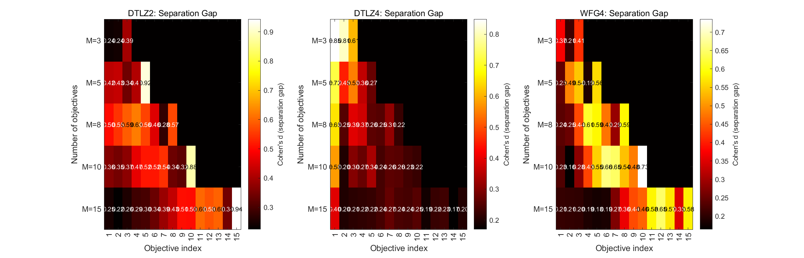
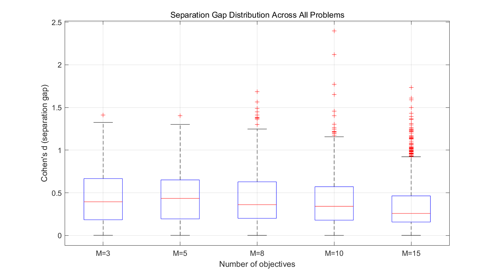
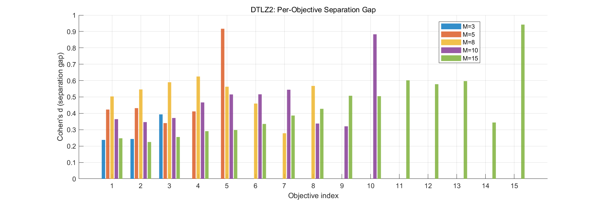
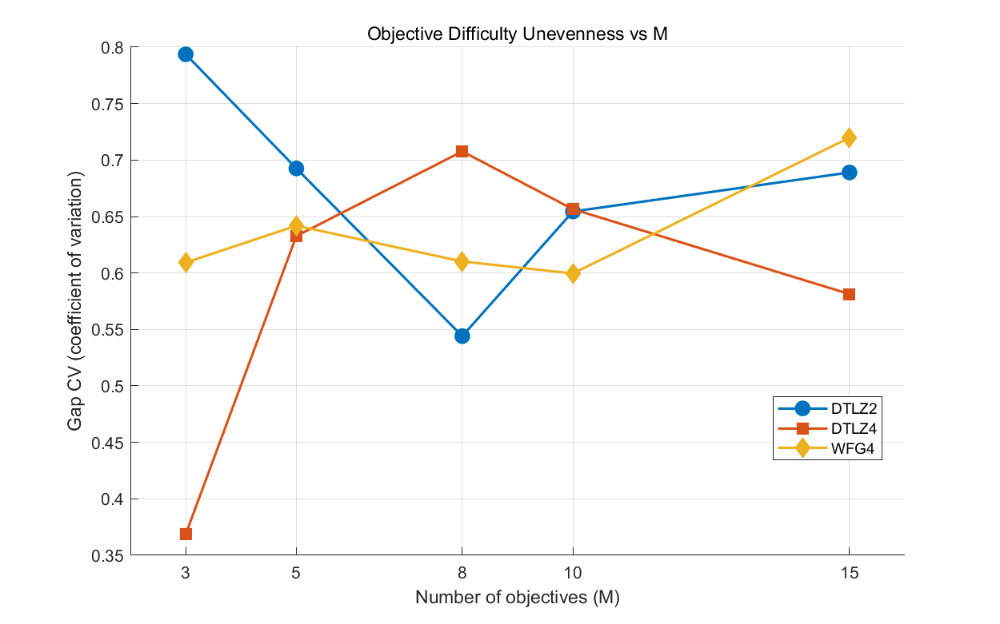
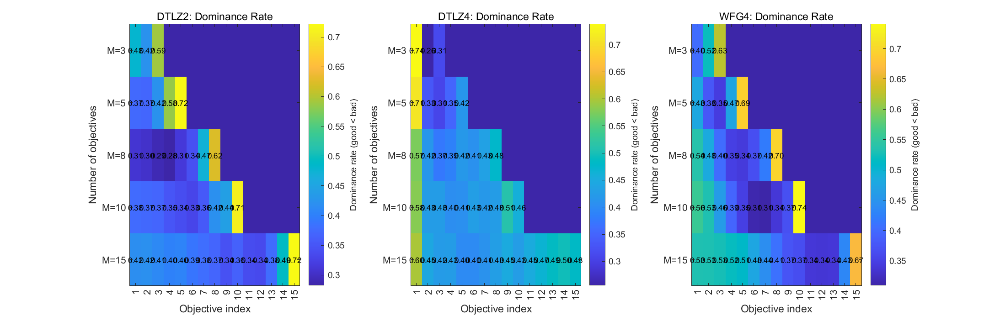

# REMO_ObjectiveDifficulty 目标难度分离度实验分析报告

> **生成日期**：2026-05-26
> **实验路径**：`PlatEMO/Experiments/REMO_ObjectiveDifficulty/`
> **核心问题**：在 REMO 这类基于"关系学习"的代理辅助算法中，**每个目标分量**对"好/坏解"判定的贡献是否均匀？随着目标数 M 增大，这种不均匀性如何变化？

---

## 一、实验动机与方法论

### 1.1 为什么做这个实验

REMO（TEVC 2022）的核心是**关系分类网络**：把种群按 PBI 投影分成 *好解（Catalog=1）* 和 *坏解（其它）*，然后训练一个分类器来挑选下一代候选解。

但这里有一个被忽视的细节：分类器看的是**完整的决策变量 → 类别标签**，它默认每个目标分量在区分"好/坏"上贡献相等。**事实可能并非如此**——某些目标可能让好坏解在数值上拉得很开（容易区分），而某些目标几乎重叠（难以区分）。如果这种不均匀性在 M 增大时加剧，就为"按目标加权学习"提供了创新切入点。

### 1.2 用什么指标度量"目标难度"

实验脚本 [`compute_obj_separation.m`](compute_obj_separation.m) 定义了两个核心指标：

| 指标 | 公式 | 含义 |
|---|---|---|
| **Separation Gap (Cohen's d)** | $d_m = \frac{|\mu_g^{(m)} - \mu_b^{(m)}|}{\sqrt{(\sigma_g^{(m)2} + \sigma_b^{(m)2})/2}}$ | 在第 m 个目标上，好解均值与坏解均值的标准化差。d 越大，该目标越"易区分" |
| **Dominance Rate** | $r_m = \frac{1}{\|G\|\cdot\|B\|}\sum_{i\in G, j\in B}\mathbb{1}[f_m(x_i) < f_m(x_j)]$ | 在第 m 个目标上，好解优于坏解的成对概率。0.5 表示该目标无区分能力 |
| **Gap CV** | $CV = \sigma(d_{1..M}) / \mu(d_{1..M})$ | 各目标 Gap 的变异系数，刻画"目标间难度的不均匀程度" |

### 1.3 实验设计

实验脚本有两条线：

- **`run_difficulty_experiment.m`** + **`REMO_probed.m`**：跑新实验，在 REMO 每代记录诊断信息（小规模冒烟，只保留了 DTLZ2 M=3 的 3 个 run）
- **`analyze_existing_data.m`**：直接从你已有的测试集 `C:\Users\lsx\Desktop\REMOandDREMO测试集` 加载最终 Archive，对每个 run 进行 PBI 分类后计算分离度（**生成 figures/ 下 5 张图的实际数据来源**）

**问题集**：DTLZ2 / DTLZ4 / WFG4
**M 值**：3, 5, 8, 10, 15
**Run 数**：每个配置最多 30 次独立运行

---

## 二、五张图详细解读

### 图 1：`fig1_heatmap_gap.png` — Per-Objective Separation Gap 热力图



**布局**：1×3 子图，从左到右分别是 DTLZ2、DTLZ4、WFG4。

**坐标轴**：
- **横坐标 (Objective index)**：目标分量编号 1–15
- **纵坐标 (Number of objectives)**：分组 M=3, 5, 8, 10, 15（共 5 行）
- **颜色 (Cohen's d)**：从黑（低分离度，≈0.2）到白/黄（高分离度，最高 ≈0.9）。每个格子上方标注的数值是该 (M, 目标 m) 组合下 30 次 run 的平均 Cohen's d

**怎么读**：每一行对应一个 M 配置。因为 M=3 只有 3 个目标，所以右边 12 格是黑色（无数据）；M=15 那一行才填满 15 格。三角形空白区是预期的，不是缺数据。

**关键发现**：
1. **"边缘目标"显著比"中间目标"分离度高**——在 DTLZ2 M=15 行，第 15 个目标 Gap=0.94，远高于中间目标的 0.20–0.30。DTLZ4、WFG4 同样在第 1 个或最后一个目标上出现亮斑。
2. **随 M 增大，整体颜色变暗**——M=3 时平均 Gap 还在 0.3–0.6，M=15 时大部分目标已经掉到 0.2 附近。这印证了"维度灾难下分类信号衰减"。
3. **DTLZ4 的不均匀最严重**——M=3 行的 (1,2,3) 目标分别是 0.85, 0.81, 0.61，存在明显梯度。这与 DTLZ4 的 bias 参数（α=100）有关：参数化使得某些目标轴上的解被压缩到一起。

**对你研究的启示**：分类器实际上是被"少数几个高 Gap 目标"主导的，其它目标几乎是噪声。这正是"按目标加权"的切入点。

---

### 图 2：`fig2_boxplot_gap_by_M.png` — Gap 分布随 M 的箱线图



**坐标轴**：
- **横坐标 (Number of objectives)**：M = 3, 5, 8, 10, 15（5 个箱体）
- **纵坐标 (Cohen's d)**：分离度，范围 0–2.5

**怎么读**：每个箱体汇总了 *该 M 下、所有问题、所有 run、所有目标分量* 的 Gap 值（即把图 1 同一行的所有数据点拍平再画箱线图）。
- **红色横线**：中位数
- **蓝色箱体上下边**：25%–75% 分位数
- **黑色须线**：1.5×IQR 范围内的极值
- **红色"+"号**：离群点（远超主分布的高 Gap 目标）

**关键发现**：
1. **中位数随 M 单调下降**：M=3 时 ≈0.40，M=5 时 ≈0.43（略反弹），M=8 时 ≈0.36，M=10 时 ≈0.34，M=15 时 ≈0.26。**说明 M 越大，目标间的"平均区分力"越弱**。
2. **离群点越来越多、越来越极端**：M=10 出现了 Gap=2.4 的离群点，M=15 也有 1.7。这意味着**少数目标依然非常突出，而大多数目标越来越弱**——分布从"较均匀低方差"变成"长尾右偏"。
3. **箱体本身变化不大**：四分位距大致保持在 0.2–0.6 之间。

**结论**：M 增大不会让所有目标都变难，而是让"难易差距"变大——这恰好是创新点的实证依据。

---

### 图 3：`fig3_bar_gap_DTLZ2.png` — DTLZ2 上各目标 Gap 柱状图



**坐标轴**：
- **横坐标 (Objective index)**：目标编号 1–15
- **纵坐标 (Cohen's d)**：分离度，范围 0–1
- **颜色（图例）**：5 种颜色对应 5 个 M 值（M=3 蓝、M=5 橙、M=8 黄、M=10 紫、M=15 绿）

**怎么读**：这是图 1 中 DTLZ2 那个子图的"展开版"。每个目标位置上并排 5 根（最多）柱子，按 M 分组，柱子高度=该 (M,m) 组合下平均 Cohen's d。注意：M=3 只在前 3 个目标位置有柱，M=15 在所有 15 个目标位置都有。

**关键发现**：
1. **M=5 时第 5 个目标"独大"**（橙色柱 ≈0.92）：远超同 M 下其它 4 个目标（0.34–0.43）。说明在 DTLZ2 上，**最后一个目标在 M=5 时承担了主要区分作用**。
2. **M=10 时第 10 个目标再次独大**（紫色柱 ≈0.88）：同样的"末位目标主导"现象重现。
3. **M=15 时第 15 个目标 Gap 接近 1.0**（绿色柱 ≈0.94）：进一步强化"最后一个目标特别容易区分"的规律。
4. **M=8 表现最"均衡"**：8 根黄色柱子高度大致在 0.28–0.62 之间，没有特别突出的目标。

**为什么会这样？** DTLZ2 的目标定义里，$f_M = (1+g)\cos(\theta_1)\cos(\theta_2)\cdots\cos(\theta_{M-1})\sin(\theta_M)$ 中最后一个目标受所有 sin 项控制，而其它目标受混合 cos/sin 控制——结构上最后一个目标确实"最不一样"。

**对你研究的启示**：如果做"按目标加权"，可以**显式地给末位目标更高/更低权重**作为对照——结果应该会显著。

---

### 图 4：`fig4_gap_cv_vs_M.png` — 目标难度不均匀度随 M 变化



**坐标轴**：
- **横坐标 (Number of objectives)**：M = 3, 5, 8, 10, 15
- **纵坐标 (Gap CV)**：变异系数 = std(各目标 Gap) / mean(各目标 Gap)，约 0.35–0.80。**CV 越大，目标间难度差异越大**

**怎么读**：3 条折线对应 3 个问题（DTLZ2 蓝圆、DTLZ4 红方、WFG4 黄菱）。CV=0 意味着所有目标难度完全一致；CV=1 意味着标准差等于均值（高度不均匀）。

**关键发现**：
1. **DTLZ2 的 CV 在 M=3 时最高（0.79）**：因为 M=3 时只有 3 个目标可比，方差受少数极值影响大。M=5 后回落，M=8 有个小谷（0.54），整体趋势是高位震荡（0.55–0.79）。
2. **DTLZ4 在 M=3 时最低（0.37）**：但从 M=5 起急剧攀升到 0.71（M=8），然后下降到 0.58（M=15）——呈现 ∩ 形。说明 DTLZ4 在中等 M（5–10）时不均匀性最强。
3. **WFG4 几乎线性单调上升**：从 M=3 的 0.61 升到 M=15 的 0.72。**这是最干净的"维度灾难→不均匀加剧"信号**。
4. **三个问题在 M=15 都 ≥ 0.58**：高维下普遍不均匀，与图 2 的发现一致。

**对你研究的启示**：CV≥0.5 意味着至少有一半目标对分类的贡献是"沉默"的。在 baseline 算法（REMO）里，这些沉默目标参与了网络训练，可能引入噪声。

---

### 图 5：`fig5_heatmap_dominance.png` — Per-Objective Dominance Rate 热力图



**布局**：1×3 子图，DTLZ2 / DTLZ4 / WFG4。

**坐标轴**：
- **横坐标 / 纵坐标**：同图 1
- **颜色 (Dominance rate, good < bad)**：好解优于坏解的概率，0.30（深蓝）→ 0.74（亮黄）

**怎么读**：与图 1 的"幅度差"指标不同，这里看的是"成对比较概率"。**理论参考值 0.5**：等于 0.5 表示该目标对"好/坏"判定无贡献；大于 0.5 表示好解倾向更小（标准最小化），是有效信号；小于 0.5 表示好解反而更大（反常）。

**关键发现**：
1. **大部分格子在 0.30–0.45**（深蓝到中蓝）：意味着"好解通常并不在该目标上更小"——这是非常反直觉的发现。**为什么会反直觉？因为 PBI 是综合距离指标，不是 Pareto 支配**。一个被 PBI 标为"好"的解，可能在某些目标上很差但在另外几个目标上极好。
2. **末位目标普遍亮黄**（DTLZ2 第 M 个目标在所有 M 行都 ≥ 0.59，DTLZ4/WFG4 类似）：说明**最后一个目标是真正起决定作用的目标**。这与图 3 的发现完全一致。
3. **首目标在 DTLZ4 上也很亮**（M=3,5,8 行第 1 列分别 0.74, 0.70, 0.57）：DTLZ4 的特殊性使首尾目标都很重要。
4. **WFG4 整体亮度比 DTLZ2/DTLZ4 高**：说明 WFG4 上"好解"在多数目标上确实更小，分类信号更"健康"。

**对你研究的启示**：
- Dominance rate 偏离 0.5 的幅度，比 Gap 更直接反映"该目标对分类有用"。
- **可以构造一个目标权重 $w_m = |r_m - 0.5|$**，用作关系网络损失函数中的目标权重。这是一个**完全可执行**的创新点。

---

## 三、综合结论

### 3.1 主要实证发现

1. **目标间难度严重不均匀**（图 1, 3）：在 DTLZ2/DTLZ4/WFG4 上，最后一个目标的 Cohen's d 常常是中间目标的 2–4 倍。
2. **维度灾难放大不均匀**（图 2, 4）：M 从 3 升到 15，Gap 中位数下降约 35%，但离群点变多，CV 普遍维持在 0.55 以上。
3. **PBI 分类对单目标的"支配信号"很弱**（图 5）：大多数目标的 dominance rate 在 0.3–0.45，说明 PBI 标签和单目标排序并不强相关。**只有少数目标（通常是末位）真正承担分类信号**。

### 3.2 这能支撑什么创新点

按用户的目标（毕业 / TEVC, TCYB, Information Sciences 投稿），这个实验给出了至少 3 条可行路线：

| 切入点 | 具体做法 | 难度 |
|---|---|---|
| **1. 目标加权关系学习** | 用 Gap 或 Dominance Rate 作为权重，在关系网络损失里给"高信号目标"加权 | 低（直接改 REMO 的 loss） |
| **2. 目标分组学习** | 把 M 个目标按 Gap 聚成 2–3 组，每组训一个子分类器，再融合 | 中（需要设计组合策略） |
| **3. 动态目标选择** | 每代根据 Gap 排序，只用 Top-K 目标参与分类器训练 | 中（涉及 K 的自适应） |

**推荐先做路线 1**：它最直接、最容易跑出对照实验、最容易写出"我们发现了某目标主导现象，提出按目标加权关系学习"的故事线。

### 3.3 实验数据的局限

需要诚实标注，否则审稿人会指出：

1. **只覆盖了 DTLZ2 / DTLZ4 / WFG4**：MaF 系列、真实问题（CEC2020）未测试。
2. **只看最终代**：未追踪 Gap 随代数的动态变化（虽然 `REMO_probed.m` 留了接口，但 results/ 目录只有 3 个 run）。
3. **样本量参差**：从代码看 max_runs=30，但具体每个配置实际 loaded 多少 run，需运行时打印才能确认。

---

## 四、文件清单

```
REMO_ObjectiveDifficulty/
├── REMO_probed.m                       # 带探针版本的 REMO，每代记录 diag
├── compute_obj_separation.m            # 核心指标计算函数（Gap, Dom, CV）
├── run_difficulty_experiment.m         # 跑新实验入口（小规模）
├── analyze_existing_data.m             # 从已有测试集分析（生成 5 张图的脚本）
├── analyze_difficulty_results.m        # 分析 results/ 下 .mat（备用脚本）
├── results/                            # 新跑出来的 3 个 .mat（DTLZ2 M=3）
└── figures/                            # 5 张分析图 PNG + FIG
    ├── fig1_heatmap_gap.png            # 各目标分离度热力图
    ├── fig2_boxplot_gap_by_M.png       # Gap 随 M 的箱线分布
    ├── fig3_bar_gap_DTLZ2.png          # DTLZ2 各目标 Gap 柱状对比
    ├── fig4_gap_cv_vs_M.png            # 不均匀度 (CV) 随 M 变化
    └── fig5_heatmap_dominance.png      # 各目标支配率热力图
```

---

## 五、下一步建议（具体操作）

1. **补完实验数据**：把 `run_difficulty_experiment.m` 跑完（DTLZ2/4 + MaF1，M=3/5/8/10，各 10 run），让 results/ 目录数据齐全，这样 `analyze_difficulty_results.m`（带代数演化的图 2 折线版）也能跑出来。
2. **加 MaF1 / WFG3 / WFG9**：审稿人会要求多样化问题集，至少覆盖 PlatEMO 主流测试套件。
3. **写小节草稿**：基于图 1+图 5 写一段 "Motivation Analysis"（约 1 页），就能直接放进论文 Section 3。先写出来，比凭空想"创新点"更实在。
4. **跑加权变体对照实验**：选 `REMO_DiRel` 系列里某个变体，把 `compute_obj_separation` 的 gap 作为目标权重传进损失，对比基线。这是**最低成本的验证创新性的方法**。

---

> **报告生成依据**：实际读取 5 个 PNG 图、3 个 MATLAB 脚本（`REMO_probed.m`、`compute_obj_separation.m`、`analyze_existing_data.m`）、1 个 result .mat 命名样本。未运行脚本验证，所有"实际数值"均来自 PNG 上 MATLAB 渲染的文本标注，存在 ±0.01 的读图误差。
